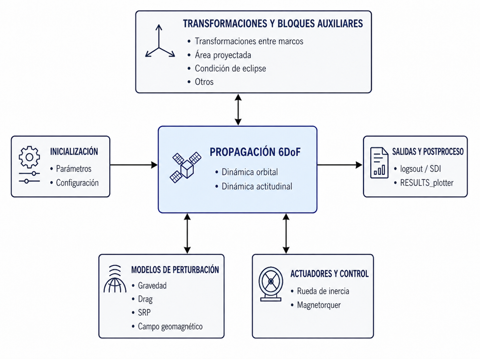
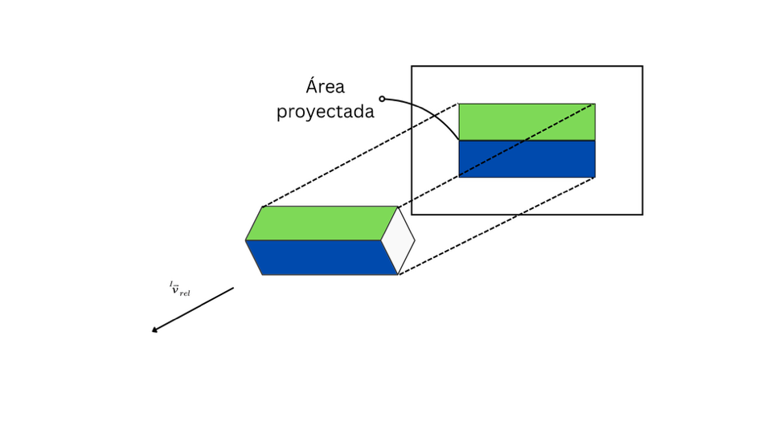
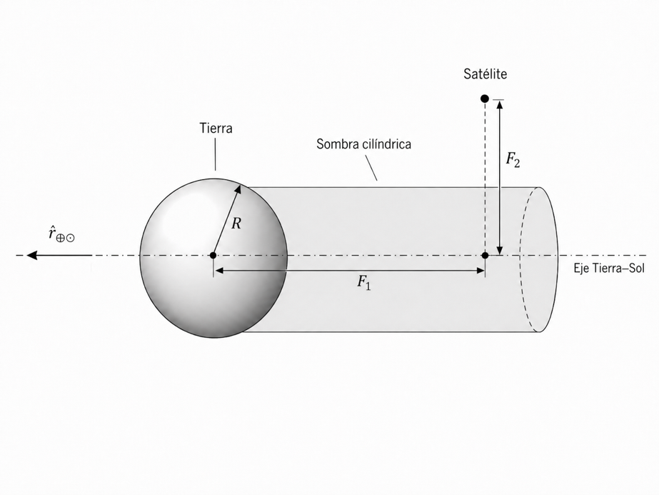

When I began my supervised professional practice at the **Centro Tecnológico Aeroespacial (CTA)**, I knew almost nothing about orbital mechanics.

Roughly 250 hours of work later, I had researched, designed, and implemented a simulator capable of propagating both a satellite's orbit and attitude, incorporating different environmental perturbations, and testing control systems.

The objective I was given sounded simple: develop a six-degree-of-freedom simulator for satellites in low Earth orbit that could be used to validate control algorithms.

The difficulty was hidden inside that sentence.

This was not just a matter of programming equations of motion. I first had to understand what needed to be simulated, which models were appropriate, how to combine different reference frames, what level of fidelity made sense, and how to verify that each result was physically coherent.

The simulator also had to be modular enough for someone else to change an initial condition, select another environmental model, or connect a controller without rebuilding the whole project.

## What does six-degree-of-freedom simulation mean?

A satellite's motion can be separated into two related parts.

The first is translational dynamics: where the satellite is and how fast it moves along its orbit. The second is rotational dynamics: where it points and how it rotates around its center of mass.

Together, these form the simulator's six degrees of freedom:

- Three position components.
- Three orientation components.

Orbital propagation uses the satellite's position and velocity. Attitude propagation uses quaternions and angular velocity, avoiding the singularities that can occur when working directly with Euler angles.

These two parts are coupled. Orbital position, for example, determines the local magnetic field and direction to the Sun, while satellite orientation can change the area exposed to the atmosphere or solar radiation.

The result is one coupled dynamic system rather than two fully independent simulations.

## Research came before implementation

Because I had no previous experience in orbital mechanics, the first phase was essentially a research project from scratch.

I studied orbital and attitude dynamics, quaternions, coordinate systems, gravity models, the upper atmosphere, solar radiation pressure, the geomagnetic field, and common ADCS actuators.

The sources cited in the final report represent only part of the material I consulted. I read books, papers, and technical documentation not only to find equations, but to understand their assumptions and decide when each model made sense.

That distinction became fundamental. An equation implemented without understanding its limitations can produce a numerically stable simulation that still represents the physical system incorrectly.

## The hardest decision: how much to model

The main challenge was not implementing one specific equation. It was deciding how to represent each perturbation.

For almost every phenomenon, several alternatives existed. A more complex model could provide more fidelity, but it could also require more inputs, increase simulation time, and make verification harder.

Computational cost was relatively easy to measure. Determining how much better each alternative represented reality was not. In several cases, clear comparisons or reliable error estimates under equivalent conditions were difficult to find.

I therefore designed the simulator with selectable levels of complexity. The objective was not to always use the most detailed model, but to choose a representation appropriate to each study.

## A modular Simulink architecture

I organized the project into three main stages:

1. Mission, spacecraft, and model initialization.
2. Coupled orbit and attitude propagation.
3. Result processing and visualization.

Inside the main Simulink model, environmental perturbations, coordinate transformations, actuators, and controllers are separated into modules.

This structure makes it possible to change the gravity model without modifying the attitude propagator, replace a controller without changing the environmental models, or disable a perturbation to study its individual effect.

The simulator was intended to work as an experimentation platform, not as a single fixed configuration.

## The models I implemented

### Earth's gravity

Gravity can be calculated using anything from a two-body approximation to models that account for the nonspherical shape and irregular mass distribution of Earth.

I implemented three levels:

- Central two-body gravity.
- The perturbation produced by the J₂ term.
- Gravitational harmonics through degree three.

The two-body model provides a low-cost reference. The J₂ term captures important effects such as the precession of the ascending node. The harmonic model adds detail when the analysis requires it.

### Atmospheric drag

Although space is often imagined as a vacuum, a residual atmosphere remains in low Earth orbit. Its interaction with the satellite produces drag and gradually reduces orbital energy. This force is the main cause why satellites fall from their orbit.

The simulator includes different atmospheric-density representations, including exponential models and the 1962 and 1976 standard atmospheres.

The spacecraft can also be represented as an equivalent sphere—the *cannonball* approximation—or as a prism whose projected area changes with attitude.

This second option makes the coupling between orbital motion and orientation visible: two spacecraft at the same position and velocity can experience different forces if they present different areas to the atmospheric flow.

### Solar radiation pressure and eclipses

Photons from the Sun transfer momentum when they strike a spacecraft.

To represent this force, I implemented solar radiation pressure together with a cylindrical eclipse model. When Earth blocks the line of sight between the spacecraft and the Sun, solar radiation pressure is disabled.

Although the force is small, its effect can become important in long simulations or for spacecraft with a high area-to-mass ratio.

### Attitude disturbances

The simulator calculates gravity-gradient torque, caused by the variation of Earth's gravitational field across the spacecraft body.

It also represents the interaction between a magnetic dipole and Earth's geomagnetic field. I used the World Magnetic Model available in Aerospace Toolbox to obtain that field.

This geomagnetic model is the only physical-model implementation that comes from an external toolbox. **The remaining models and their integration into the simulator were completely developed by myself specifically for this project.**

## Actuators and control

In addition to the space environment, I implemented models of actuators commonly used in attitude determination and control systems.

The simulator includes reaction wheels with physical limits and magnetorquers commanded through a magnetic dipole.

As a demonstration, I integrated a simple reaction-wheel controller. The test used a satellite in a circular equatorial orbit and attempted to maintain nadir pointing.

It was not intended to be an advanced controller. Its role was to demonstrate the complete chain: orbital propagation, local reference generation, attitude error, control law, actuator, and spacecraft response.

## How I verified the simulator

A simulator is not validated simply because it produces plausible-looking plots.

Verification was performed at different levels. I first compared individual models against reference results, including functions from Aerospace Toolbox. I then ran dynamic campaigns to check that the system responded correctly to controlled changes.

The tests covered:

- State consistency and conservation in ideal cases.
- Orbital precession produced by J₂.
- Semimajor-axis decay due to drag.
- Gravity-gradient torque.
- Response to changes in the geomagnetic field.

In the orbital-decay test, the difference between the simulated rate and the theoretical estimate was on the order of 3.85 × 10⁻¹² m/s.

These results do not imply that every possible scenario is automatically validated, but they provide evidence that the main modules reproduce the expected physical behavior.

## How to run it

The basic workflow has three steps:

1. Configure the mission, spacecraft, and models in `INIT_parametros.m`.
2. Run the main model, `sim_orbit_min.slx`.
3. Process the results with `RESULTS_plotter_main.m`.

The initialization file defines orbital and attitude initial conditions, spacecraft properties, simulation duration, active perturbations, and model-complexity levels.

The outputs can be used to study the trajectory, orbital elements, forces and torques, attitude, angular rates, nadir-pointing error, and ground track.

## What building it from scratch meant

The most important part of this project was not any single model.

It was going through the complete process: starting without a solid background in orbital mechanics, researching the problem, comparing alternatives, justifying decisions, programming every module, connecting them, and verifying the resulting system.

The project forced me to move from learning equations to making engineering decisions.

It also taught me that a useful simulator is not necessarily the one with the most complex model available. It is the one that makes its assumptions explicit, lets the user select an appropriate level of complexity, and provides concrete ways to check its results.

I developed the simulator independently over approximately 250 hours and delivered it to the Centro Tecnológico Aeroespacial as the result of my supervised professional practice.

The code is now public for anyone who wants to study it, use it, or continue developing it:

**[View the 6-DoF LEO satellite simulator on GitHub](https://github.com/Allaneo/6-DoF-LEO-Simulator)**
