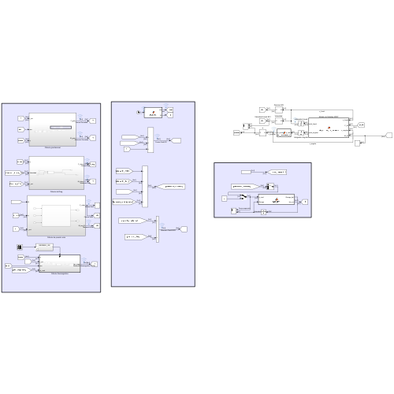

Cuando empecé mis Prácticas Profesionales Supervisadas en el **Centro Tecnológico Aeroespacial (CTA)**, prácticamente no sabía mecánica orbital.

Unas 250 horas de trabajo después, había investigado, diseñado e implementado un simulador capaz de propagar tanto la órbita como la actitud de un satélite, incorporar distintas perturbaciones ambientales y probar sistemas de control.

El objetivo que recibí parecía sencillo de expresar: desarrollar un simulador de seis grados de libertad para satélites en órbita baja terrestre que pudiera utilizarse para validar algoritmos de control.

La dificultad estaba escondida dentro de esa frase.

No se trataba solamente de programar ecuaciones de movimiento. Antes tenía que entender qué debía simular, qué modelos eran apropiados, cómo combinar sistemas de referencia distintos, qué nivel de fidelidad tenía sentido y cómo verificar que cada resultado fuera físicamente coherente.

Además, el simulador debía ser lo suficientemente modular como para que otra persona pudiera modificar condiciones inciales, cambiar un modelo ambiental o conectar un controlador sin tener que reconstruir el proyecto completo.

## ¿Qué significa simular seis grados de libertad?

El movimiento de un satélite puede separarse en dos partes relacionadas.

Por un lado está la dinámica traslacional: dónde se encuentra el satélite y a qué velocidad se mueve a lo largo de su órbita. Por el otro, la dinámica rotacional: hacia dónde apunta y cómo gira alrededor de su centro de masa.

Esos son los seis grados de libertad del simulador:

- Tres componentes de posición.
- Tres componentes de orientación.

La propagación orbital utiliza la posición y la velocidad del satélite. La propagación de actitud utiliza cuaterniones y velocidad angular, evitando las singularidades que pueden aparecer al trabajar directamente con ángulos de Euler.

Ambas partes se encuentran conectadas. Por ejemplo, la posición orbital determina el campo magnético local y la dirección hacia el Sol, mientras que la orientación del satélite puede modificar el área expuesta al flujo atmosférico o a la radiación solar.

El resultado es un sistema dinámico acoplado, no dos simulaciones completamente independientes.

## Antes de programar, había que aprender el problema

Como no tenía experiencia previa en mecánica orbital, la primera etapa fue esencialmente una investigación desde cero.

Tuve que estudiar dinámica orbital, dinámica de actitud, cuaterniones, sistemas de coordenadas, modelos gravitatorios, atmósfera terrestre, presión de radiación solar, campo geomagnético y actuadores utilizados en sistemas ADCS.

La bibliografía citada en el informe final representa solamente una parte de todo el material consultado. Leí libros, artículos y documentación técnica no solo para encontrar ecuaciones, sino para entender sus hipótesis y saber cuándo tenía sentido utilizarlas.

Esa diferencia terminó siendo fundamental. Implementar una fórmula sin entender sus límites puede producir una simulación que funciona numéricamente y, aun así, representa mal el sistema físico.

## La decisión más difícil: cuánto modelar

El desafío principal no fue implementar una ecuación concreta. Fue decidir cómo representar cada perturbación.

Para casi todos los fenómenos existían varias alternativas. Un modelo más complejo podía ofrecer mayor fidelidad, pero también requerir más datos, aumentar el tiempo de simulación y dificultar la verificación.

Medir el costo computacional era relativamente sencillo. Determinar cuánto mejor representaba la realidad cada alternativa no siempre lo era. En varios casos fue difícil encontrar comparaciones claras o información precisa sobre el error de cada modelo bajo las mismas condiciones.

Por eso diseñé el simulador con distintos niveles de complejidad seleccionables. La idea no era utilizar siempre el modelo más detallado, sino poder elegir una representación adecuada para cada estudio.

## Una arquitectura modular en Simulink

Organicé el proyecto en tres grandes etapas:

1. Inicialización de la misión, el satélite y los modelos.
2. Propagación conjunta de la órbita y la actitud.
3. Procesamiento y visualización de resultados.

Dentro del modelo principal, las perturbaciones ambientales, transformaciones de coordenadas, actuadores y controladores están separadas en módulos.

Esta estructura permite, por ejemplo, cambiar el modelo gravitatorio sin modificar el propagador de actitud, reemplazar un controlador sin alterar los modelos ambientales o aislar una perturbación para estudiar su efecto individual.

La intención era que el simulador no quedara limitado a una única configuración, sino que funcionara como una plataforma para experimentar.

## Los modelos implementados

### Gravedad terrestre

La gravedad puede calcularse utilizando desde una aproximación de dos cuerpos hasta modelos que incorporan la forma no esférica y la distribución irregular de masa de la Tierra.

Implementé tres niveles:

- Gravedad central de dos cuerpos.
- Perturbación producida por el término J₂.
- Armónicos gravitacionales hasta grado tres.

El modelo de dos cuerpos resulta útil como referencia y tiene un costo computacional bajo. El término J₂ permite capturar efectos importantes como la precesión del nodo ascendente. El modelo de armónicos agrega mayor detalle cuando el análisis lo requiere.

### Arrastre atmosférico

Aunque suele imaginarse el espacio como un vacío, en una órbita baja todavía existe una atmósfera residual. Su interacción con el satélite produce una fuerza de arrastre que reduce gradualmente la energía orbital. Esta fuerza es la principal causa de que los satélites caigan.

El simulador incluye diferentes representaciones de densidad atmosférica, entre ellas modelos exponenciales y modelos basados en las atmósferas estándar de 1962 y 1976.

También permite representar al satélite como una esfera equivalente -la aproximación conocida como *cannonball*— o calcular el área proyectada de un prisma según su actitud.

Esta segunda opción hace visible el acoplamiento entre la dinámica orbital y la orientación: dos satélites en el mismo punto y con la misma velocidad pueden experimentar fuerzas distintas si presentan áreas diferentes al flujo atmosférico.

### Presión de radiación solar y eclipses

Los fotones provenientes del Sol también transfieren momento al impactar sobre el satélite.

Para modelar esta fuerza implementé la presión de radiación solar junto con un modelo cilíndrico de eclipse. Cuando la Tierra bloquea la línea de visión entre el satélite y el Sol, la presión de radiación se anula.

Aunque la fuerza sea pequeña, su efecto puede ser significativo en simulaciones prolongadas o en vehículos con una relación elevada entre superficie y masa.

### Perturbaciones sobre la actitud

El simulador calcula el torque de gradiente gravitatorio, producido por la diferencia del campo gravitatorio a lo largo del cuerpo del satélite.

También incorpora la interacción entre un dipolo magnético y el campo geomagnético terrestre. Para obtener ese campo utilicé el World Magnetic Model disponible en Aerospace Toolbox.

Ese modelo geomagnético es la única implementación que proviene de una herramienta externa. **El resto de los modelos y de la integración del simulador fue totalmente desarrollado por mí específicamente para el proyecto.**

## Actuadores y control

Además de representar el ambiente, implementé modelos de actuadores utilizados en sistemas de determinación y control de actitud.

El simulador incluye ruedas de inercia con límites físicos y magnetorquers comandados mediante un dipolo magnético.

Como demostración integré un controlador sencillo de rueda de inercia. La prueba se realizó sobre un satélite en una órbita circular y ecuatorial, con el objetivo de mantenerlo apuntando al nadir, es decir, hacia la Tierra.

No pretendía ser un controlador avanzado. Su función era demostrar que la cadena completa funcionaba: propagación orbital, referencia local, error de actitud, ley de control, actuador y respuesta dinámica del satélite.

## ¿Cómo verifiqué que funcionara?

Un simulador no se valida solamente porque produce gráficos razonables.

La verificación se realizó en distintos niveles. Primero comparé modelos individuales con resultados de referencia, incluyendo funciones disponibles en Aerospace Toolbox. Después ejecuté campañas dinámicas para comprobar que el sistema respondiera como debía ante cambios controlados.

Entre las pruebas se incluyeron:

- Conservación y coherencia del estado en casos ideales.
- Precesión orbital causada por J₂.
- Variación del arrastre al modificar C_d·A.
- Decaimiento del semieje mayor por arrastre.
- Torque de gradiente gravitatorio.
- Respuesta a variaciones del campo geomagnético.

En la prueba de decaimiento orbital por arrastre, la diferencia entre la tasa obtenida por simulación y la estimación teórica fue del orden de 3.85 × 10⁻¹² m/s. 

Estos resultados no demuestran que cualquier escenario posible quede automáticamente validado, pero sí aportan evidencia de que los principales módulos reproducen los comportamientos físicos esperados.

## Cómo utilizar el simulador

El flujo básico está pensado para ser directo:

1. Configurar la misión, el satélite y los modelos en `INIT_parametros.m`.
2. Ejecutar el modelo principal `sim_orbit_min.slx`.
3. Procesar los resultados con `RESULTS_plotter_main.m`.

Desde la inicialización pueden definirse las condiciones orbitales y de actitud, propiedades del vehículo, duración de la simulación, perturbaciones activas y nivel de complejidad de los modelos.

Los resultados permiten analizar la trayectoria, los elementos orbitales, las fuerzas y torques, la actitud, las velocidades angulares, el error respecto del nadir y la traza sobre la superficie terrestre.

## Lo que realmente significó construirlo desde cero

Lo más importante para mí no fue implementar un modelo particular.

Fue atravesar el proceso completo: comenzar sin conocimientos sólidos de mecánica orbital, estudiar el problema, comparar alternativas, justificar decisiones, programar cada módulo, conectarlos y finalmente verificar el comportamiento del sistema.

El proyecto me obligó a pasar de aprender ecuaciones a tomar decisiones de ingeniería.

También me enseñó que un simulador útil no necesariamente es el que contiene el modelo más complejo posible. Es el que hace explícitas sus hipótesis, permite seleccionar el nivel adecuado para cada análisis y ofrece formas concretas de comprobar sus resultados.

El simulador fue desarrollado individualmente durante aproximadamente 250 horas y entregado al Centro Tecnológico Aeroespacial como resultado de mis Prácticas Profesionales Supervisadas.

Ahora también está disponible públicamente en GitHub para quien quiera estudiarlo, utilizarlo o continuar desarrollándolo:

**[Ver el simulador 6DoF para satélites LEO en GitHub](https://github.com/Allaneo/6-DoF-LEO-Simulator)**
