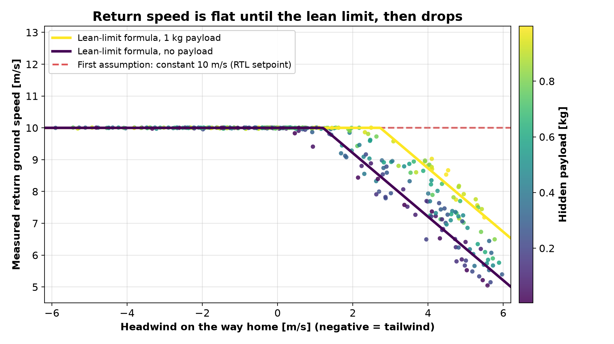
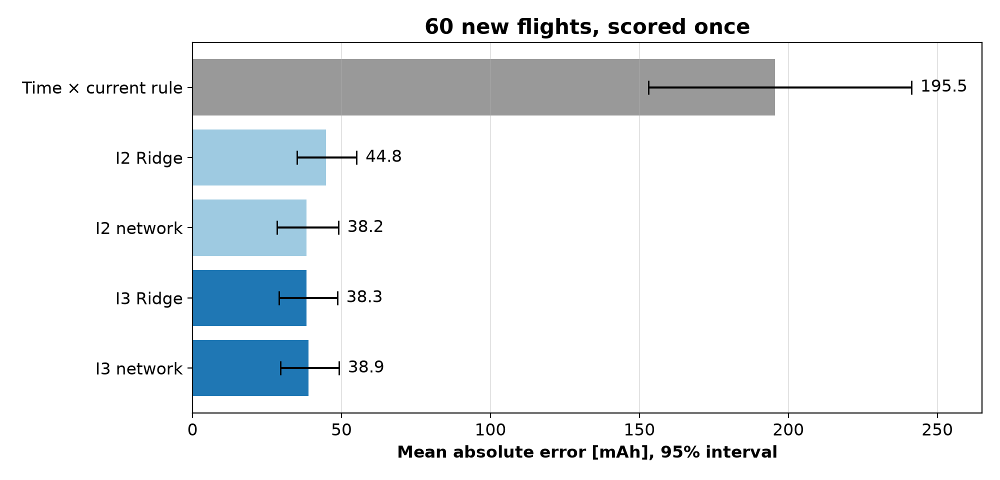
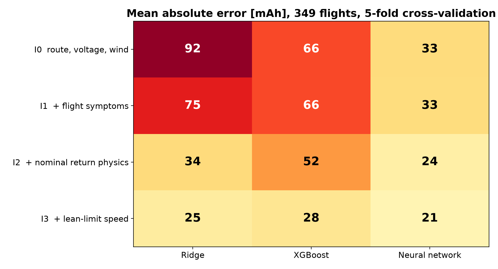
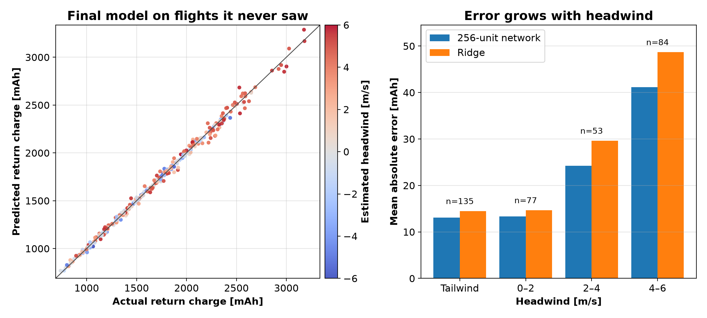



Every drone flight has a moment when someone, or something, decides it is time to go home. On a multicopter running ArduPilot, the open-source autopilot, that is Return to Launch (RTL): climb to a safe altitude, fly straight back, descend, land, disarm. A pilot can trigger it, and so can the autopilot itself when the battery runs low.

When an autopilot is set up to return on low battery, the trigger is usually a fixed threshold. ArduPilot's low-battery failsafe uses a set remaining capacity, and PX4, the other major open-source autopilot, a set fraction of the battery (its critical level defaults to 7%). A fixed threshold does not know whether home is 200 m away with the wind behind you or 1.5 km away into a strong headwind.

Which raises a simple question with an annoying answer. At the moment RTL starts, how much battery will the trip home cost?

After finishing *Advanced Learning Algorithms*, the second course of Andrew Ng's Machine Learning Specialization, I wanted to point its tools, neural networks and tree ensembles, at that question. In [the previous project](/posts/explaining-orbital-decay-to-a-linear-regression/) the lesson was that the features mattered more than the algorithm. I expected this one to be about architectures. Once again it was mostly about what I told the models, and above all about how fast the drone actually flies home.

## The question, made precise

The model predicts the charge, in milliamp-hours (mAh), used from the moment RTL is commanded until the motors disarm on the ground. It may only use what the vehicle knows at that moment: where home is, how high it is flying, the battery voltage, what the onboard estimator thinks the wind is, and ten seconds of recent flight data (current, throttle, motor outputs, attitude).

Comparing the prediction with the remaining charge is simple arithmetic. The hard part is the prediction.

## Flying 349 drones without crashing any

I could not fly hundreds of real drones in controlled wind, so I used ArduPilot SITL (software in the loop). SITL compiles the real ArduPilot flight code, with the same estimator, controllers and flight modes that run on a flight controller, and connects it to a simulated quadcopter instead of real sensors and motors.

A Python script flew every mission over MAVLink, the message protocol autopilots and ground stations use to talk to each other: take off, fly out on a set bearing and distance, hover there for a 10 second decision window, command RTL, and wait for the automatic disarm. Each flight became one row of data. Its target, read from the onboard log, agreed with an independent integration of battery current within 0.47 mAh on every flight.

The scenarios varied distance from home (200 to 1,500 m), altitude (30 to 120 m), a constant wind of 0 to 6 m/s from any direction, and a payload of 0 to 1 kg on a 3 kg quad.

The payload needed a small patch to the simulator. SITL's frame model does define the vehicle's mass, but changing it also changes the reference airframe and its propulsion calibration; the patch adds a payload on top of an unchanged airframe. The model never sees it. A heavier drone draws more current and needs more throttle, and the model has to infer the weight from those symptoms, the way a real autopilot would have to. It does not see the true wind either, only the estimate from ArduPilot's EKF (extended Kalman filter, the onboard estimator that fuses the sensors into position, velocity and, here, wind), which was off by about 0.5 m/s on average.

The first 250 flights were split by scenario into training (172), validation (39) and test (39).

## The obvious rule

The simplest estimate is the one a pilot might do in their head: expected return time multiplied by the current being drawn right now. On the final test flights, that rule's mean absolute error (MAE) was 196 mAh, about 11% of a typical return. The current while hovering at the decision point is not the current on the way home, and the time home depends on the wind in ways the rule does not capture, as it turned out.

## Letting the models find it

I compared three model families on four input sets, each carrying more precomputed physics than the last (the repository calls them F0 to F3):

| Set | What it adds | Inputs |
| --- | --- | ---: |
| I0 | Route, battery voltage, EKF wind estimate | 15 |
| I1 | Ten-second summaries of current, throttle, motors, attitude and motion | 36 |
| I2 | Headwind, crosswind, nominal return time at the 10 m/s RTL speed, required airspeed, current × time | 47 |
| I3 | The same physics rebuilt around a predicted return speed (below) | 43 |

The counts look bigger than they are. Most inputs are several summaries of the same few signals over the 10 second hover (mean, spread, percentiles), a few never change in these flights, and the speed inputs say little while the drone is holding position. Effectively, the models work with about a dozen independent quantities: distance, altitude, direction, voltage, wind, current, throttle, lean, and the physics built from them.

The models were Ridge regression (linear regression with a penalty on large weights), XGBoost (gradient-boosted decision trees), and neural networks I wrote in NumPy so I could see every part of the training: ReLU (rectified linear unit) activations, the Adam optimizer, a Huber loss (squared error for small misses and absolute error for large ones, which prevents extreme outliers from dominating the training process) and early stopping.

The first result was the most course-like one. On the original test flights, with the raw I0 inputs, Ridge missed by 77 mAh and a small network by 35. The network could combine distance, wind and voltage into something useful by itself; the linear model could not. Give Ridge the physics-derived inputs of I2, though, and it dropped to 27 mAh, level with the network at 26.

The trees were a different story, and I will come back to them.

## The speed I got wrong

Every time-based input needs a return speed. My first assumption was the obvious one: RTL flies home at its 10 m/s setpoint, so the time home is the distance divided by 10 m/s.

For most flights the logs agreed. ArduPilot's position controller holds 10 m/s over the ground: with a tailwind it leans less, and with a moderate headwind it leans harder and still makes 10 m/s. In the figure below, the dashed line is that assumption and the dots are what actually happened.

The problem is on the right, which is exactly where the battery matters most. Beyond a certain headwind, the drone stops holding 10 m/s and slows steadily. That is where it reaches its maximum lean angle, 30° by default in ArduPilot. It cannot tilt further, so it cannot produce more horizontal thrust, and whatever the wind takes away comes straight off the ground speed.

## The lean limit

At the lean limit the drone settles at roughly the airspeed where drag balances the horizontal component of thrust. In training flights that was 11.8 m/s, give or take 0.8.

The spread is not noise. It is weight. In steady flight at a fixed lean angle the horizontal force is W tan 30°, with W the weight, so a heavier drone pushes harder and reaches a higher airspeed before drag catches up (ρ is the air density and C_D A the drag area):

$$W\tan 30^\circ \approx \tfrac{1}{2}\rho V_{max}^2 C_D A$$

Across payload thirds, the lean-limited airspeed rose from 11.2 to 12.7 m/s. At the limit, heavier drones flew faster into the wind.

The model does not know the payload, but the throttle does. So the speed formula uses throttle as a stand-in for weight, and a straight line was enough over this range. With V_max the lean-limited airspeed, and v_head and v_cross the estimated headwind and crosswind:

$$V_{max} = a + b \cdot \text{throttle}$$

$$v_{ground} = \min\left(10,\ \sqrt{V_{max}^2 - v_{cross}^2} - v_{head}\right)$$

Two parameters, fitted only on flights that spent most of their return at the lean limit. With all 349 flights, a = 5.38 m/s and b = 15.09 m/s. The solid lines in the figure are this formula for an empty drone and one carrying 1 kg.

I3 feeds this speed into the return time, the required airspeed, current × time and a drag term, so every time-based input now respects the lean limit.

## A tree cannot go where it has not been

Before writing the formula, I tried the machine learning way: a random forest predicting return speed from the same decision-time inputs. It did well, but on validation it never predicted below about 7.2 m/s, even for flights that crawled home at 5.

That is not a bug; it is how trees work. A tree predicts averages of the training examples in each leaf, so it cannot predict outside the range it has seen. And it had seen very little: of the first 250 flights, only 17 flew home into 4 m/s or more of headwind. The same limitation probably contributes to XGBoost trailing on every input set, although it is not the whole story: XGBoost ran with one fixed configuration, while the networks got a full architecture sweep.

The formula extrapolates because it is a physical relation, not a lookup. But the underlying problem was real for every model: 17 flights is too few to learn the hardest cases from.

## So I flew more of the hard ones

I flew 39 extra training flights, all with 4 to 6 m/s of wind within 30° of straight into the return path.

With them, the forest's floor disappeared and it nearly caught up with the formula: on new flights its speed error was 0.29 m/s, against 0.24 for the formula and 1.76 for a fixed 10 m/s. I did not run a separate experiment to measure how much the extra flights helped the charge models themselves, so I will not claim a number. But every final model trained on them, and strong headwind stopped being a region the models had barely seen.

## The honest test

By this point the 39 validation flights and the 39 test flights had guided too many decisions to count as a final exam. So I generated 60 new flights, half in strong headwind and half across the whole envelope. Before scoring any of them I wrote down the candidate models, the random seeds, the training rules and the comparisons I would make. Then I scored them once.

The mean return on those flights used 1,809 mAh. The leading candidates, I3 Ridge and the I3 network, missed by about 38 to 39 mAh, roughly 2%, on a set deliberately loaded with difficult headwind flights. The time × current rule missed by 196.

The honest reading is modest. The top models are within each other's uncertainty: I3 Ridge beat I2 Ridge by 6.5 mAh, with a 95% interval from −15.4 to +1.9. Consistent, but 60 flights cannot separate models a few mAh apart. And below 2 m/s of headwind every learned model was already within about 1 to 2% of the truth. The models differ in strong headwind, where errors roughly double.

## Architecture mattered less than I expected

The course is about neural networks, so I swept them properly: 15 shapes, from 16 units to 1,024, from one layer to ten, each trained with three seeds. A single layer of 1,024 units won on validation and went into the honest test.

Then I repeated the sweep with five-fold cross-validation on all 289 training flights, so every flight took a turn as validation. The winner's lead disappeared:

| Model | Parameters | Cross-validated MAE (mAh) |
| --- | ---: | ---: |
| 256 units | 11,521 | 20.5 |
| 512 units | 23,041 | 20.8 |
| 64-32-16 | 5,441 | 21.8 |
| 1,024 units | 46,081 | 21.9 |
| 128-64-32 | 16,001 | 22.1 |
| Ridge | 44 | 22.6 |
| 16 units | 721 | 25.9 |
| 10 layers × 16 | 3,169 | 50.8 |

Everything from about 5,000 to 46,000 parameters landed within about 2.5 mAh. The 1,024-unit network was still competitive, but its lead had come from picking the best of many fits on 39 flights, which is exactly how a small validation set can fool you.

I was surprised that no deeper network did better, so I checked whether they were simply undertrained: I let them train up to 3,000 epochs instead of 600. No shape moved by more than 0.7 mAh, and the deeper networks stopped on their own well before the limit. Once the inputs carry the lean-limit physics, what is left to learn is smooth enough for one wide layer. Only the ten-layer network failed, and that is a training difficulty, not a lack of epochs.

One detail mattered more than depth. A network starts from random weights, set by a seed, so two networks trained on the same data with different seeds end up slightly different. Training three copies with different seeds and averaging their predictions, flight by flight, beat every single copy. For the 256-unit network, the three copies alone erred by 23.1 to 24.7 mAh on average; their averaged prediction erred by 20.5. That is not a paradox: on a given flight one copy may guess 30 mAh high and another 30 mAh low, and their average lands close to the truth. Averaging the predictions cancels part of each copy's individual error.

## Inputs against models, on all the data

For the last comparison I used all 349 flights, five-fold cross-validation and the 256-unit network.

The network was best on every input set, and it depended least on precomputed physics: 33 mAh from raw inputs. Ridge gained the most from physics, from 92 to 25, because it cannot build nonlinear combinations by itself. XGBoost barely moved until I3 (66, 66, 52, then 28): trees cannot extrapolate to the slow lean-limited returns, and the speed formula does that for them.

## The final model

The final model is the 256-unit network on the I3 inputs, averaged over three seeds and trained on all 349 flights.

To estimate how well it predicts flights it has never seen, I used nested cross-validation. The whole procedure (choose between Ridge and three network shapes, then train) was repeated inside five folds, and each fold was scored on flights it never touched. It chose 256 units in four of the five.

Mean absolute error: 21.6 mAh (95% interval 19.1 to 24.2), about 1.2% of the charge. This number answers a different question from the 38 mAh of the honest test: it estimates how well the final selection procedure does across all 349 flights, of which only about a quarter are strong headwind, rather than on a fresh set weighted towards the hard cases. About 13 mAh with a tailwind or light headwind, 24 at 2 to 4 m/s, 41 at 4 to 6 m/s. A typical strong-headwind case: a flight 1.37 km from home, 5.1 m/s into the wind and carrying 0.5 kg used 2,948 mAh to get home. The model, which never saw that flight, predicted 2,918. The time × current rule said 3,448.

## Why not a fixed threshold?

A fixed battery threshold has to pick one number for every return. In these flights, the return cost anywhere from 738 to 3,182 mAh, with a median of 1,659.

Size the threshold for a typical return, and on the flight above the drone would start home with about 1,290 mAh less than it needed. Understating is the dangerous side: the vehicle runs out before it gets home and ends in a forced landing or a crash, somewhere you did not choose.

Size it for the worst return ever seen, 3,182 mAh, and the flight above gets home with about 230 mAh to spare; good, right? Now take a short, easy return: 313 m from home, a light tailwind, 0.4 kg of payload. It used 774 mAh, and the model predicted 769. With the worst-case threshold, that drone would have turned back with about 2,400 mAh still unused, more than three times what the trip home actually cost. Overstating is safe but expensive: missions end early, the drone covers less ground per battery, and the usual fix is a bigger, heavier battery that costs endurance of its own.

A prediction that adapts to distance, wind and load lets the return start when it is actually needed, with a reserve sized for the model's error rather than for the worst case in the whole envelope.

## Where it still misses

The worst underprediction was 130 mAh, and the misses have a clear pattern: return speed. On the honest test, the two biggest misses followed speed overestimates of 0.7 to 0.9 m/s, and in strong headwind the charge error tracked the speed error closely (correlation −0.81). An earlier experiment points the same way. Before the extra headwind flights, an earlier Ridge model trained on the first 172 flights underpredicted one validation flight by 414 mAh. Given the *measured* return speed instead of a predicted one, which no drone has in advance, its worst miss dropped to 60 mAh. Better speed prediction at the lean limit is the remaining lever.

These models predict the expected charge, so the real return often costs a little more: the final model under-predicted 47% of the flights. Anyone using a prediction like this should add a reserve on top, sized from held-out errors so that a chosen share of flights, say 95%, uses less than the prediction plus the reserve. Given how the errors grow with headwind, that reserve should probably grow with headwind too.

## What this is not

This is one simulated quad in SITL's built-in physics, with constant, uniform wind and a point-mass payload. Real wind gusts, real batteries sag with temperature and age, and real current sensors need calibration. The model predicts expected charge, not a safety guarantee.

What would carry over is the structure. The inputs are mostly things any multicopter logs: route, wind estimate, current, throttle. The lean limit itself is a controller setting, so a real ArduPilot vehicle will hit it too. What is not validated is everything that follows from it on real hardware: the airspeed it settles at, how that scales with weight, and how much energy the return then costs.

For another drone, or for real flights of this one, I would refit the two parameters of the speed formula from a few flights at the lean limit, then adapt the network instead of starting over: keep its hidden layer and retrain the output layer on a few dozen real flights, or train a small correction model on the gap between reality and the simulation-trained prediction. I have not tested either, so that is a next step, not a result.

## What I took away

**Look at what the system actually does before modelling it.** My first speed assumption was right for most flights and wrong exactly where it mattered. The logs showed a hard limit I had not accounted for.

**A formula can go where the data has not.** The forest could not predict speeds it had never seen. Two parameters with a physical reason behind them could.

**When the hard cases are rare, go and get more of them.** 17 strong-headwind flights were not enough to learn from.

**Be suspicious of a winner picked on a small validation set.** The 1,024-unit network won the first sweep, but that sweep compared 45 networks on the same 39 flights, and the best of 45 scores on so few flights is partly luck. With cross-validation on all 289 training flights it landed in the middle of the pack, and the good networks were all within about 2.5 mAh of each other.

**Inputs over architecture, again.** The same lesson as the orbital decay project, reached from the other side: the network could get a long way from raw inputs, but every model did best when the physics was computed for it.

The simulator setup, the flight pipeline, the models and every figure in this post are public:

**[View the ArduPilot RTL charge predictor on GitHub](https://github.com/Allaneo/ardupilot-rtl-charge-predictor)**
