

First, a quick clarification: we didn't actually go to outer space. 

Our "space" was a suborbital sounding rocket reaching an apogee of around one kilometer. But when you are tasked with autonomously steering a fragile payload back to a precise landing zone and delivering an unboiled, raw grocery egg completely unbroken, one kilometer feels plenty high enough.

When the competition rules were published, one requirement defined our entire project: **the CanSat payload had to descend using an autonomous, steerable recovery system and deliver a raw egg from 2 meters above the ground.**

The mission brief split the recovery sequence into two distinct phases:

1. **The Container Phase**: After rocket apogee ejection (absorbing a **~30 G** shock), the container had to stabilize and descend at **15 m/s ± 3 m/s** using a dedicated passive parachute.
2. **The Payload Phase**: Mid-air, the container released our payload, which was required to deploy an **autonomous steerable descent system** descending between **2 and 8 m/s**, navigate toward a target coordinate, and autonomously release the egg payload **2 meters above the terrain** completely intact.

Designing, building, and testing the container's passive parachute took just a few days of work. It was a straightforward flat octagonal chute with shroud lines cut to 1.25× the diameter.

Fulfilling the steerable descent requirement, however, meant building an autonomous ram-air parafoil from scratch. That turned into a multi-month engineering journey through flexible-wing aerodynamics, custom MATLAB trim tools, photo forensics, sewing machine jams, millimeter-precise Kevlar rigging, and high-altitude drone descent tests.

> *Note: This article focuses strictly on the technical design, modeling, manufacturing, and flight testing of the system. A companion post covering the broader organizational and personal learnings from this project is currently in the works and will follow soon.*

---

## 1. Aerodynamic Foundations & Literature Insights

When we started researching steerable flexible wings, we initially treated ram-air parachutes and paragliders as interchangeable concepts. They are not.

  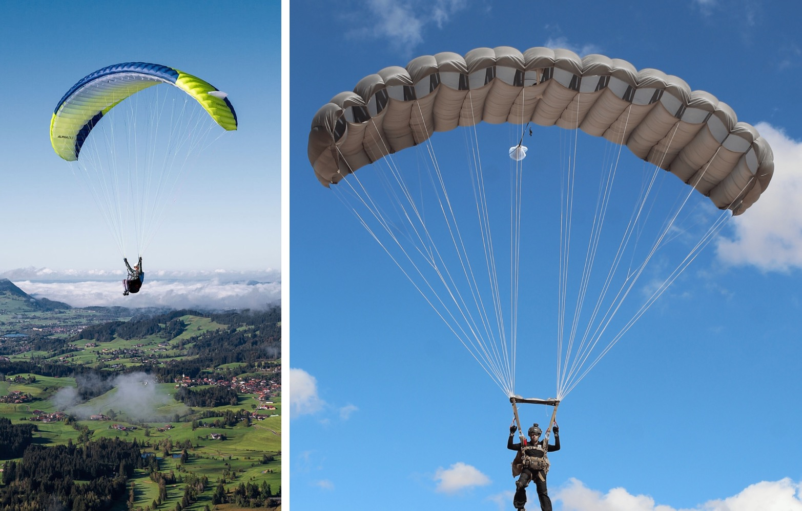
  

    <strong>Left</strong>: Foot-launched Paraglider (High AR, thin profile, under-surface inlets). 
    <strong>Right</strong>: Air-deployed Ram-Air Parachute (Low AR, thick profile, large forward-facing inlets).
  

A paraglider is **ground-launched**. The pilot runs forward on a slope to inflate the cells with clean air before taking off. Because opening shock is negligible and glide performance is everything, paragliders feature high aspect ratios (AR ≈ 5–6), thin airfoils, and small inlets tucked underneath the lower surface.

A ram-air parachute is **air-deployed**. It is released into free-fall at high descent rates. If you deploy a high-AR, thin paraglider into free-fall, the wingtips fold inward, the narrow bottom inlets starve of air, and the lines tangle before the canopy can inflate.

Air-deployed canopies (documented in classic parachute literature by Knacke and Lingard) require a different design paradigm:
- **Low Aspect Ratio (AR ≈ 1.8–2.2)** to ensure spanwise opening rigidity.
- **Thick airfoils (~16–18%)** to maximize internal cell volume and pressurization.
- **Large, forward-facing leading-edge inlets** directly exposed to the oncoming relative airflow.

### Sizing the Inlets: Understanding Lingard's Regimes
A ram-air parachute is an inflatable fabric beam that only holds an aerodynamic shape because dynamic pressure forces its way into the open leading edge and pressurizes it from within:

$$q = \tfrac{1}{2}\rho V_\infty^2$$

When sizing the inlets, we studied J.S. Lingard’s foundational paper on ram-air canopies. The paper addresses two distinct operating regimes that we had to carefully separate:
1. **Steady-State Cruise**: An inlet height of **8.4%c** (chord fraction) is sufficient once the wing is already gliding, because the opening only needs to encompass the narrow movement of the stagnation point across cruising angles of attack.
2. **Dynamic Deployment & Inflation**: For the initial opening phase, where the canopy tumbles through turbulent, off-axis flow, the paper uses an average inlet height of **14%c** (11%c at the rigid ribs, and 15%c in the fabric billow between ribs).

Our initial design used an undersized inlet (0.09c), which proved too tight during deployment disturbances. Expanding the inlet opening to the dynamic deployment regime was essential for reliable openings.

### The Mystery of the 45-Degree Inlet Angle
Knowing the inlet height was only half the equation. What angle should the inlet cut make with the chord line?

We searched papers and technical manuals, but found no explicit values for the diagonal cut angle. So we turned to photographic analysis: we downloaded photos of skydiving canopies, paused YouTube videos of scale RC parachutes frame-by-frame, and inspected 3D canopy models.

  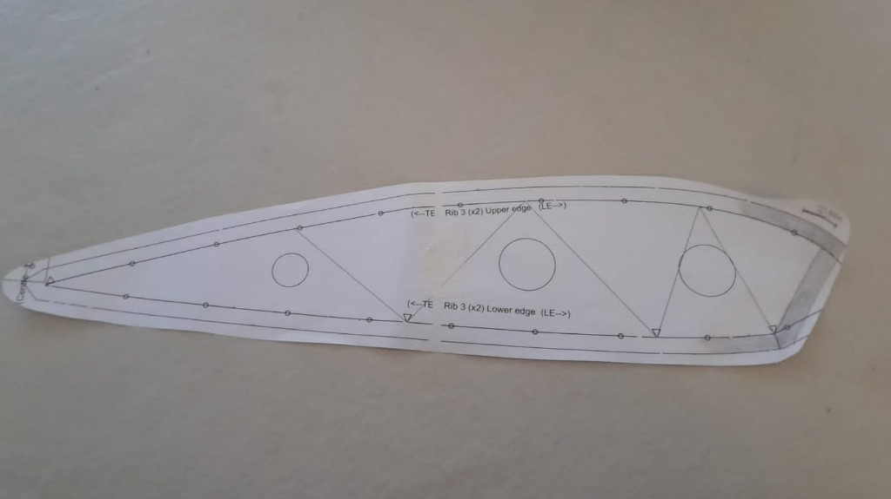
  

    The printed rib pattern showing the 45° diagonal leading edge inlet cut and circular cross-port holes.
  

By comparing the cutback geometry across multiple designs, we deduced a **45° diagonal cut**. This angle made physical sense with our expected relative velocity vector during cruise flight, allowing the oncoming airflow to enter the cells cleanly while preserving enough upper-surface chord to maintain lift generation over the suction peak.

### The 18% Clark Y Profile
Lingard frequently refers to the **Clark Y** airfoil, a historic profile with a flat lower surface that simplifies cutting and sewing fabric ribs.

  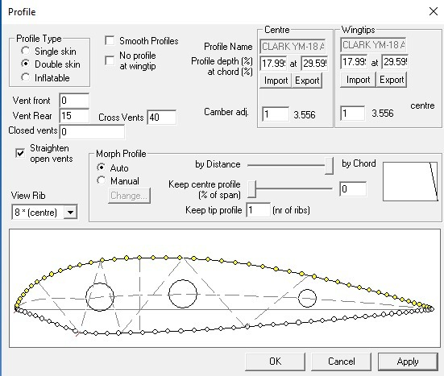
  

    Surfplan profile configuration: Clark Y thickened to 18% (17.99% at 29.59% chord) with 15% leading edge vent opening.
  

Standard Clark Y has a maximum thickness of 11.7%. Lingard's paper explicitly evaluated a **Clark Y thickened to 18%**. We didn't fully catch the implications of this modified thickness at first, but we figured it out quickly before designing Mk 2. The thicker profile significantly increases internal cell volume and pressurization, providing structural stiffness without internal rigid spars.

### The 5-Second Warning in *SingleSkin* & The Line Length Catch
During early tests, our outer wingtips kept folding inward as soon as line tension developed. None of our standard textbooks explained the cause.

The breakthrough came from an unexpected source. While testing geometry in an open-source paraglider program called ***SingleSkin***, a floating pop-up message appeared on screen and faded away after 5 seconds:

> `WARNING: The angle between the outer suspension lines and the local lower canopy surface shall be greater than 90°`

That single, transient message pointed out the problem: if a suspension line attaches at an acute angle (θ < 90°), line tension creates an **inward lateral force component** that drags the fabric toward the center, collapsing the cell. When θ > 90°, tension pulls slightly outward, stabilizing the span.

However, achieving an angle greater than 90° at the wingtips presented a major engineering trade-off: you either have to change the spanwise shape of the canopy (introducing an anhedral arc) or lengthen the suspension lines.

**And there's a catch: the length of the lines is critical for both static and dynamic stability.** The line length sets the pendulum distance between the center of pressure (CP) of the canopy and the hanging center of gravity (CG) of the payload. Changing this distance directly alters the restoring pitch moments, the pendulum oscillation frequency, and the aerodynamic damping of the entire system.

### The Anhedral Arc Solution
Because excessively long lines add parasite drag and worsen pendulum dynamics, we kept the lines short and solved the bridle angle constraint by curving the canopy into an **anhedral arc**. We adopted an **82° total curvature arc**, allowing payload weight to pull outward along the lines and maintain spanwise tension across the canopy without requiring long suspension lines.

---

## 2. Aerodynamic Modeling, Trim & Dynamics

### 2.1 Parasite Drag, Glide Ratio, and Descent Speed
At CanSat scale, the canopy accounts for only a fraction of the total system drag. The suspension lines, payload body, and carbon fiber structural rods all act as bluff bodies in the airflow.

  

    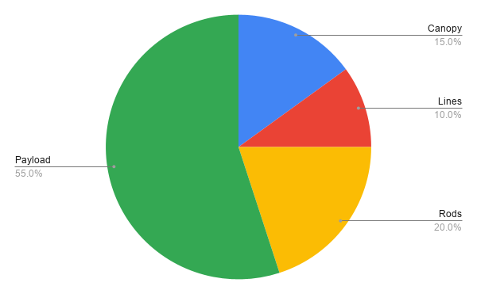
    
Total parasite drag breakdown: payload body and rods generate 75%.

  

  

    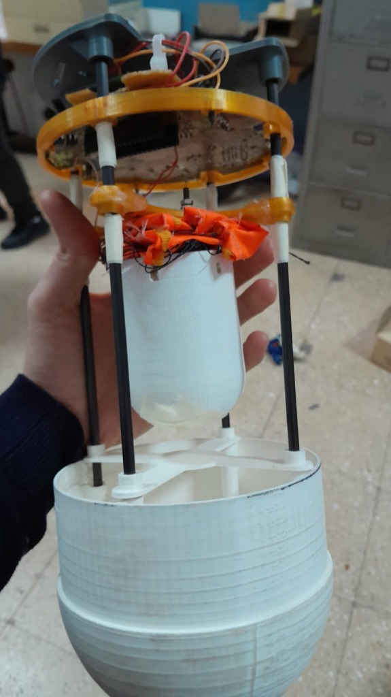
    
Chassis with 4 structural carbon rods (⌀5mm).

  

The significant parasite drag from the payload and structure limited our realistic glide ratio to around L/D ≈ 2–3, fixing our glide angle at:

$$\gamma = -\arctan\left(\frac{1}{L/D}\right) \approx -18^\circ \text{ to } -26^\circ$$

However, a defined L/D determines only the glide slope, not the descent velocity. The vertical sink rate (V_sink) depends on the equilibrium airspeed Va along that glide slope:

$$V_a = \sqrt{\frac{2 m g}{\rho S \sqrt{C_L^2 + C_D^2}}}$$

$$V_{\text{sink}} = V_a \sin(-\gamma)$$

Balancing our total payload mass (m ≈ 554 g), canopy reference area (S = 0.53 m²), and total drag coefficient yielded an equilibrium airspeed Va ≈ 8 m/s and a vertical sink rate of **≈ 5 m/s**, landing cleanly within the **2 to 8 m/s mission requirement**.

### 2.2 Aerodynamic Coefficients & MATLAB Trim Analysis
To evaluate equilibrium flight, we used **XFLR5** and **Flow5** to extract 3D aerodynamic lift, drag, and moment coefficients for the canopy.

  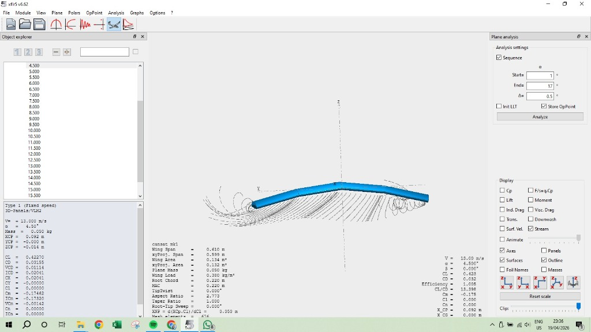
  

    3D flow stream lines and aerodynamic panel analysis of the canopy in XFLR5.
  

I then developed a dedicated **MATLAB trim program** that coupled the aerodynamic polars with the pendulum dynamics of the suspended payload:

The trim solver balanced aerodynamic forces and pitching moments about the system center of mass:

$$C_{M,\text{total}} = C_{M,\text{canopy}} + C_{M,\text{arm}} + C_{M,\text{lines}} = 0$$

$$\frac{dC_M}{d\alpha} < 0 \quad (\text{Longitudinal Static Stability})$$

The program yielded our nominal cruise operating point:
- **Cruise Airspeed (Va)**: ≈ 8 m/s
- **Trim Angle of Attack (α_trim)**: ≈ 3°
- **Rigging Angle (θ_rig)**: ≈ 11.7° relative to the payload vertical axis
- **Pitch Restoring Derivative (dCm/dα)**: Strongly negative, confirming static pitch stability.

### 2.3 Guidance Architecture & Spiral Divergence
For autonomous navigation, we adopted a two-tier framework:
- **Outer Loop (3-DoF Guidance)**: Managed trajectory planning and waypoint tracking based on airspeed, flight path angle, and heading.
- **Inner Loop (6-DoF Dynamics)**: Controlled servo brake line actuation using quaternions to avoid matrix singularities during attitude disturbances.

Our simulations and the literature highlighted an important dynamic constraint: **ram-air canopies under high wing loading are susceptible to spiral divergence during sustained turns.**

If the autopilot commands a continuous turn in one direction, the outer wing accelerates, the bank angle steepens, the nose drops, and the sink rate increases rapidly.

To counter this:
- Bank angle was software-limited.
- Turn rates were strictly bounded.
- The GNC used **alternating figure-8 holding patterns** near waypoints instead of continuous circling.

---

## 3. Canopy Evolution: Mk 1 to Mk 2

We built two full double-skin canopy prototypes:

  

    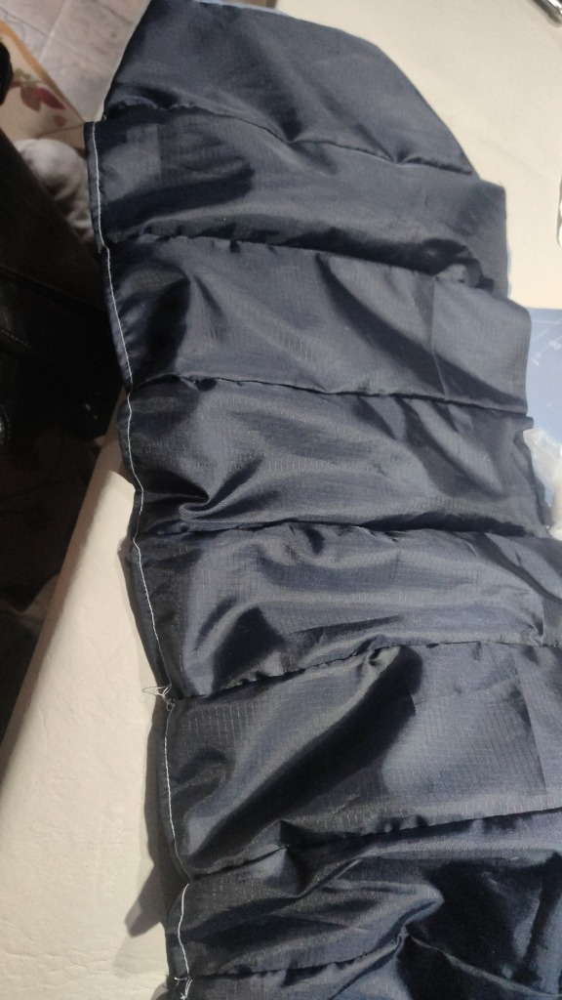
    
<strong>Mk 1 Prototype</strong>: Compact initial double-skin test wing.

  

  

    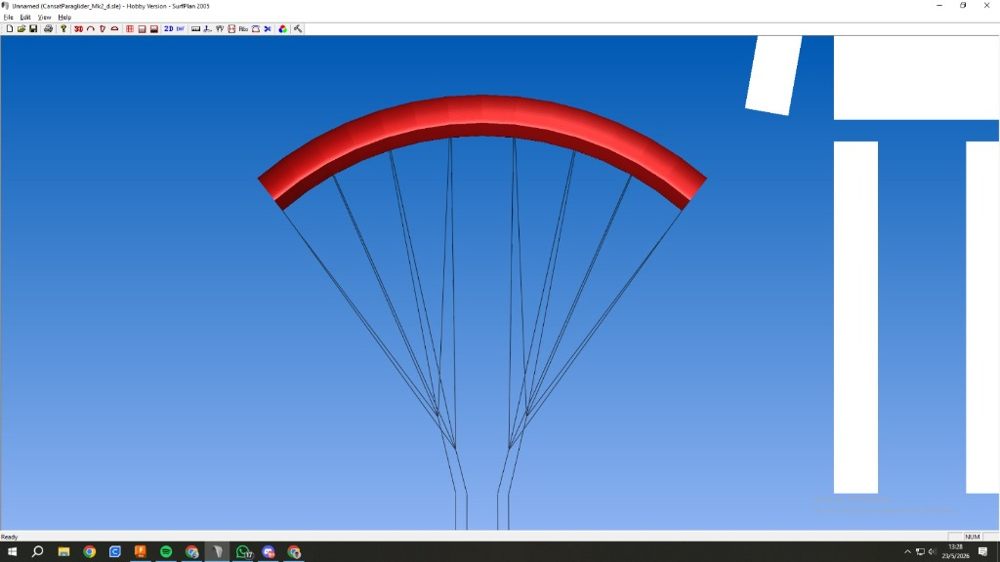
    
<strong>Mk 2 Surfplan Model</strong>: Scaled 8-cell canopy with 82° anhedral arc.

  

### Mk 1: The Initial Double-Skin Prototype
Our first fabricated prototype, Mk 1, was a compact double-skin parafoil. While it proved we could cut and sew an inflated structure, testing revealed three core issues:
1. **Acute Line Angles**: Outer line attachments had angles < 90°, causing wingtip collapse.
2. **Small Inlets**: Sized around 0.09c, the inlets struggled to catch airflow reliably during dynamic deployment.
3. **High Wing Loading & High Angle of Attack**: Because the lifting area was too small for our payload mass, the canopy could only produce enough lift by flying at a much higher angle of attack (AoA). Operating near stall AoA degraded control authority, increased drag, and reduced the safety margin.

### The Wing-Loading Discovery & Mk 2
Between Mk 1 and Mk 2, we identified a critical design factor in the literature relating **lifting surface area to total suspended payload mass** (wing loading).

This empirical relationship showed that to achieve our target descent speed at a safe cruise angle of attack, our canopy needed to be roughly twice as large. For Mk 2, we doubled the wing area and refined the geometry in *Surfplan*:

- **Surface Area (S)**: 0.53 m²
- **Wingspan (b)**: 1.03 m
- **Constant Chord**: 50 cm across all panels
- **Airfoil**: 18% thick Clark Y with 45° diagonal inlets (14%c opening)
- **Span Curvature**: 82° anhedral arc
- **Cross-Port Venting**: Circular holes cut with scissors into every internal rib, allowing cells to share internal pressure during asymmetric gusts.

Adopting a **constant chord of 50 cm** was a major manufacturing decision. On Mk 1, tapered wingtips required sewing tiny rib profiles, which proved extraordinarily difficult and prone to dimensional errors on a standard sewing machine. A constant rectangular chord ensured all fabric ribs and panels were identical, making pattern cutting and assembly repeatable.

### The Center of Gravity Blunder & The Architectural Workaround
Once Mk 2 was completely manufactured, we realized we had made a serious calculation mistake: **our rigging line lengths had been calculated assuming the payload CG was at the top attachment plate.**

In reality, the heavy electronics and battery bay placed the actual CG much lower in the body, completely throwing off the pendulum arm and pitching moment balance.

Building a "Mk 3" canopy was out of the question: fabricating Mk 2 had taken days of intense manual labor and we were running out of time. We had to fix the stability problem without remaking the wing.

We solved it with two adjustments:
1. We modified the Kevlar line lengths to compensate for the offset.
2. **We physically moved the electronics bay much higher inside the CanSat structure**, pulling the true CG upward.

This turned out to be a great example of how legacy requirements can trap a design: the electronics had originally been placed near the bottom to satisfy an older structural requirement that no longer applied after a later chassis revision. Freeing up that constraint allowed us to rebalance the system's pitch stability without cutting a single new fabric panel.

---

## 4. Manufacturing & The Millimeter Rigging Protocol

### 4.1 Fabric, Thread & Patterns
- **Low-Porosity Coated Ripstop Nylon**: Low air permeability is essential for ram-air canopies. If air leaks through the fabric, internal pressure drops and the profile deflates. We used PU/silicone-coated ripstop nylon (~40–50 g/m²).
- **Paper Patterns & Assembly**: We printed full-scale CAD paper patterns with seam margins and alignment markers.
- **The "Toile" (Tual)**: Before cutting expensive coated nylon, we sewed a complete prototype out of cheap scrap cloth (a *toile*). This caught seam allowance issues, clearance errors, and panel assembly order mistakes early.
- **Thread & Needle**: We used high-tenacity Tex T-45 bonded nylon thread with **#10/70 ball-point needles**. Sharp needles can pierce and slice structural yarns in ripstop fabric; ball-point needles push between the weave fibers without cutting them.

  

    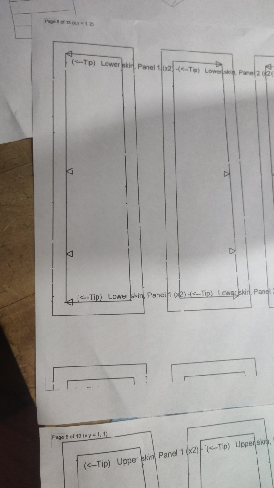
    
Printed CAD patterns

  

  

    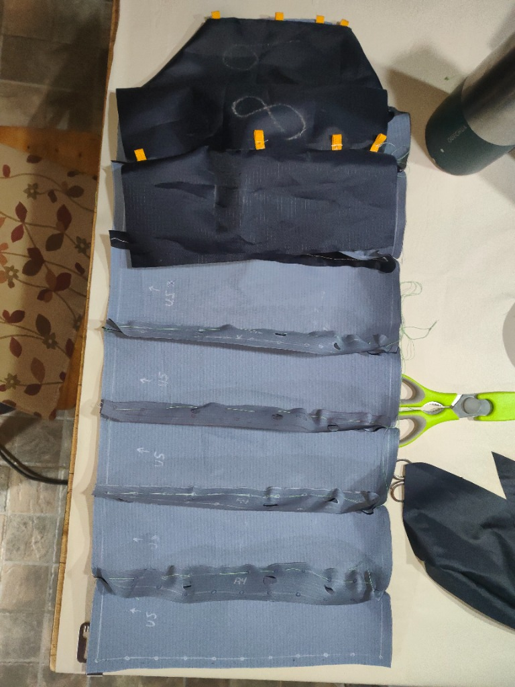
    
Sewing clips & chalk lines

  

  

    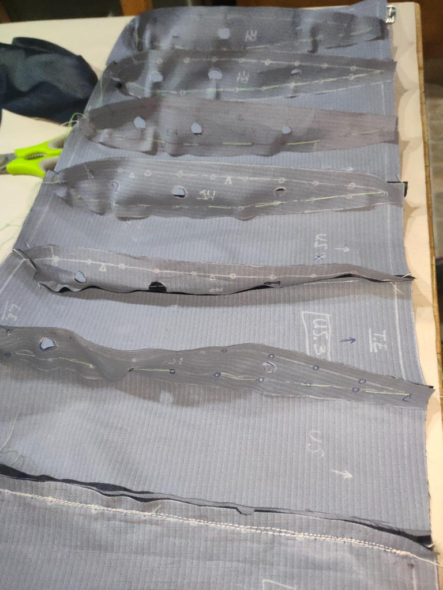
    
Scissors-cut cross-ports

  

  

    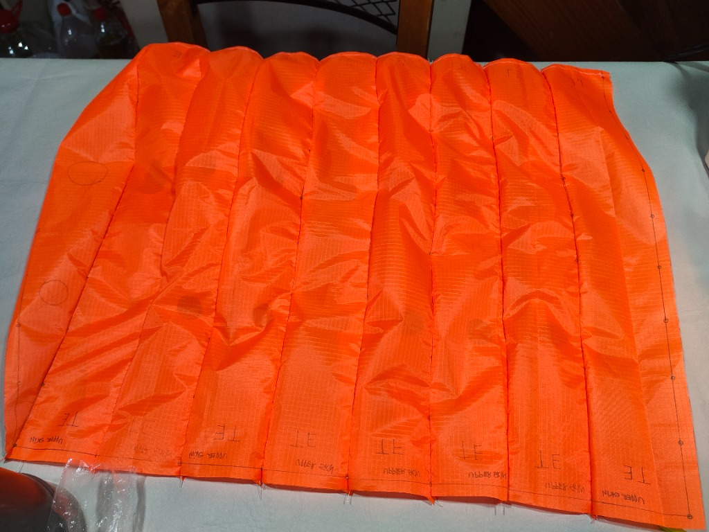
    
Upper skin panels with TE marks

  

### 4.2 The Precision Kevlar Rigging Protocol
We selected 50 lb braided Kevlar cord (D ≈ 0.5 mm) for the suspension lines due to its high strength and near-zero elastic stretch.

However, **tying a knot consumes line length**. On a flexible canopy, an error of just a few millimeters noticeably alters the local angle of attack.

To maintain millimeter precision across all lines, we executed a strict rigging protocol:
1. **Zero-Indexed Ruler**: We trimmed a steel ruler so the scale started precisely at the physical metal edge.
2. **Cutting & Looping**: A piece of Kevlar line was cut with extra length, and a termination loop was formed on one end.
3. **Calibrated Measurement**: Measuring from the loop, we marked the exact calculated length onto the line. This length depended on the rib station (`Ribs 1, 3, 5, 7`) and line row (`POWER: A, B, C` or `BRAKE: D`).
4. **Anchoring**: The line was tied to the canopy rib tab with a knot positioned so the mark coincided exactly with the attachment point, then locked with a drop of cyanoacrylate (super glue).
5. **Riser Interface**: The power lines from all rows on each side were gathered together into a single bundle going down to their respective riser, while the trailing-edge brake lines were routed to the servos. Lines connected to the 15mm polyester risers using stainless steel split-rings, allowing modular adjustment without untying knots.

  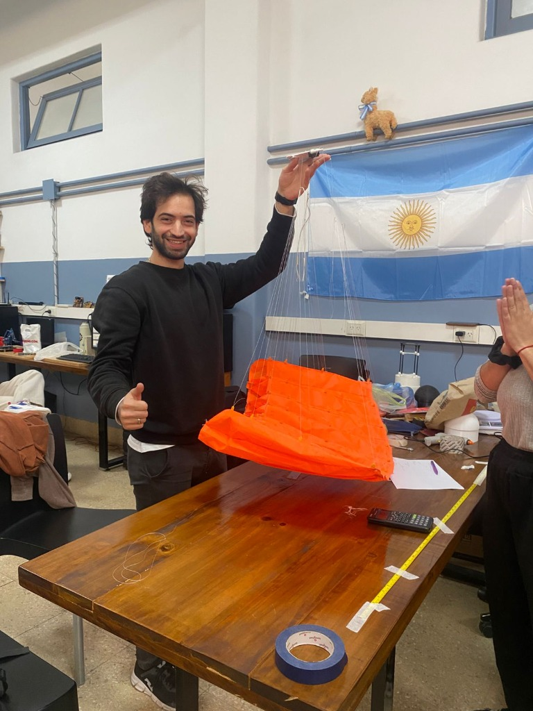
  

    Holding the completed Mk 2 canopy with tensioned suspension lines above the workshop table.
  

---

## 5. Deployment: The D-Bag & Anti-Tangle Webbing Harness

### The Zero-G Free-Fall Trap
We initially wondered if a Deployment Bag (D-Bag) was strictly necessary, hoping the canopy might deploy cleanly straight from the container. We were wrong.

When a packed canopy is pushed out of an ejecting container into free-fall, the payload and canopy accelerate downward at the same rate. Without line tension, the lines go completely slack. The canopy tumbles through its own loose lines, risking not only severe entanglements, but a complete failure to inflate.

### Thought-Out & Tested: Packing Inside the D-Bag
Because of this free-fall dynamics trap, the exact way we packed the ram-air parachute inside the D-Bag was deliberately thought out, engineered, and rigorously tested through dozens of trial extractions.

We did not simply roll or stuff the fabric in. We developed a repeatable packing method:
1. **Accordion Cell Flaking**: The canopy cells were flaked accordion-style on the table, ensuring that the 45° leading-edge inlets stayed neatly aligned facing forward and clear of internal folds.
2. **Staged Line Stowing**: The suspension lines were stowed in neat S-folds using elastic retention bights, ensuring they would deploy progressively from the riser cascades upward to the canopy without tangling.
3. **Sequential Line-First Extraction**: When the container drogue pulls the D-Bag, the suspension lines extract first and pull fully taut under payload inertia.
4. **Tension-Triggered Canopy Release**: Only after the lines are under full tension does the mouth of the D-Bag open, releasing the canopy directly into clean airflow.
5. **Center-Out Inflation**: The forward 45° inlets catch dynamic pressure and inflate symmetrically from the center outward within 1.0 to 1.5 seconds.

Analyzing our high-speed footage confirmed this principle: every manual release that had inflated reliably was one where the lines were pulled taut before canopy release, exactly as our D-Bag staging protocol forced them to do.

### The Anti-Tangle Webbing Harness
To prevent line tangles during extraction, we built an **anti-tangle webbing structure** using 15mm polyester straps.

This structure linked the power and brake risers together right at the top end of the risers, just before the split rings connecting to the line cascades (functioning similarly to a slider, but fixed in place). It kept the line bundles separated during packing and prevented cross-wrapping during deployment without adding moving parts.

---

## 6. Field Testing Campaign

We skipped wind tunnel testing for the parafoil. Testing a flexible, non-rigid, inflatable fabric wing inside a small wind tunnel is notoriously difficult compared to real outdoor flow. We took testing directly to the field.

1. **High Structure Releases (15 to 30 m)**: Releasing the assembly from tall buildings confirmed that the D-Bag pulled lines taut before canopy release and verified cell inflation symmetry.
2. **Drone Flight Releases (100 to 250 m)**: Using a multi-rotor drone, we carried the CanSat to altitude and released it into free-fall for complete descent tests.

  <video controls style="width: 100%; border-radius: 10px; box-shadow: 0 4px 12px rgba(0,0,0,0.12);" preload="metadata">
    <source src="drone-descent-test.mp4" type="video/mp4">
    Your browser does not support the video tag.
  </video>
  

    <em>Drone descent test: validating payload separation, line stretch under tension, ram-air canopy inflation, and stable glide descent.</em>
  

The descent tests validated the core deployment and aerodynamic performance:
- The D-Bag staged the opening cleanly, allowing the canopy to inflate symmetrically within **1.0 to 1.5 seconds** of line stretch.
- The parafoil established a stable glide with a vertical sink rate of **≈ 5 m/s**, comfortably satisfying the **2 to 8 m/s descent requirement**.

---

## 7. Final Thoughts

When we started this project, there was no complete manual for building an autonomous micro ram-air parachute. The foundational academic papers provided high-level equations, but left out the critical practical details that make a flexible wing actually work: the exact leading-edge cut angle, the bridle geometry required to prevent outer cell collapse, and the staged deployment kinematics needed to inflate a soft wing out of zero-G free-fall without tangling.

We had to figure out nearly every critical parameter through direct deduction and experimentation:
- Deducing the 45° inlet angle by pausing and analyzing skydiving footage frame-by-frame.
- Catching the 90° line-angle constraint from a fleeting 5-second pop-up warning in open-source paraglider software.
- Doubling the wing area for Mk 2 after realizing our initial wing loading was too high for a safe glide angle.
- Rescuing the entire build after a major center-of-gravity calculation mistake by questioning our own structural layout and moving the battery bay upward.
- Engineering and validating a repeatable D-Bag packing sequence and anti-tangle riser harness through iterative drop tests.

Despite incomplete literature data, calculation blunders, and tight deadlines, we ended up with a fully functional, deployable ram-air parachute that pressurized symmetrically, held its aerodynamic profile, and achieved stable glide descent from scratch. 

Taking fragmented theory, testing it against real physics, and solving each practical roadblock with our own hands in the workshop was the real achievement of this build.

A companion post focusing on our broader organizational learnings, team workflow, and post-competition takeaways will be published soon.

---
