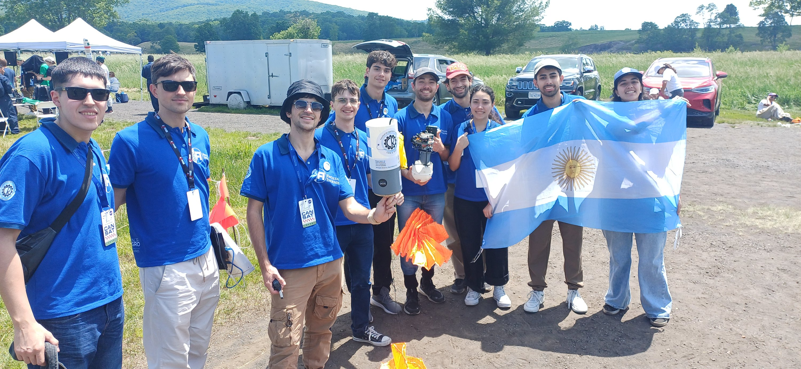
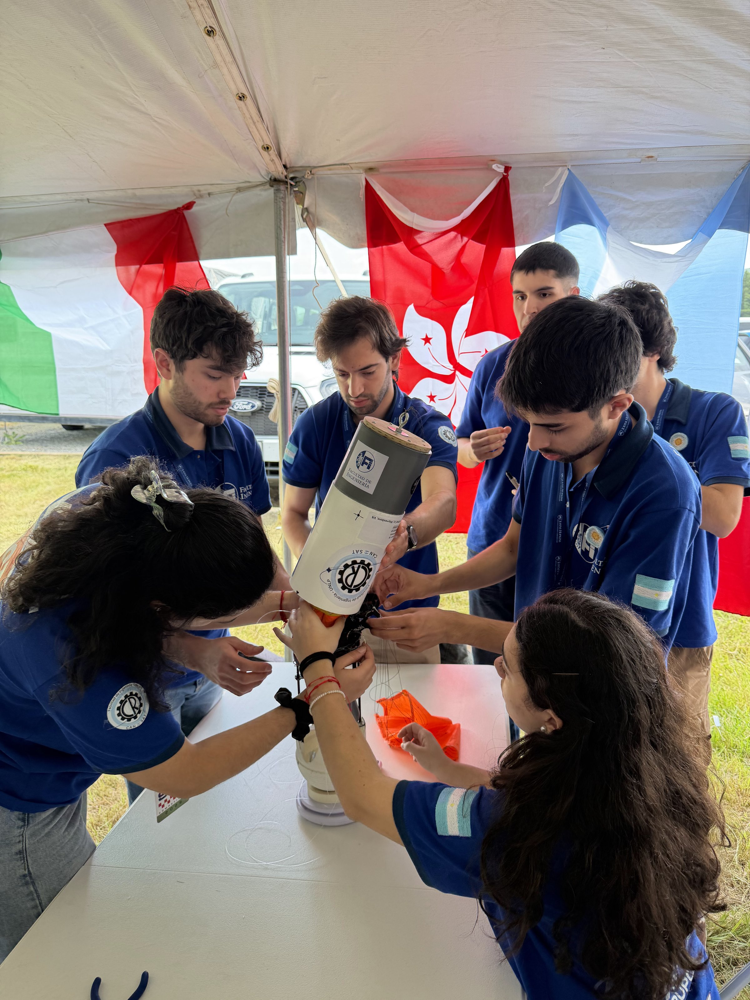
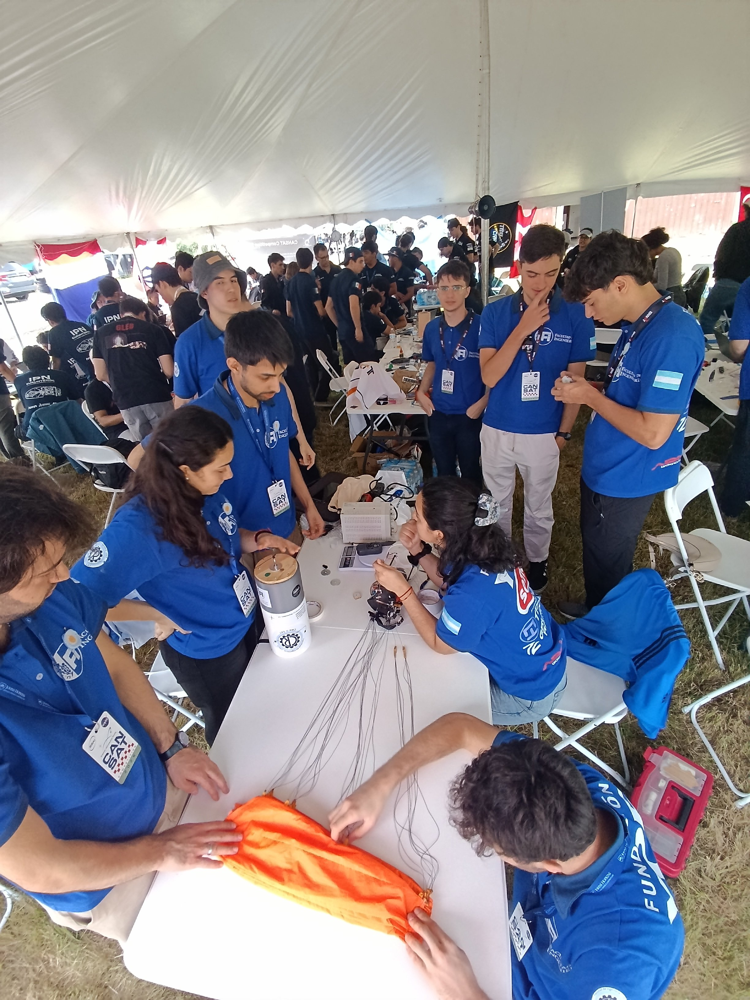
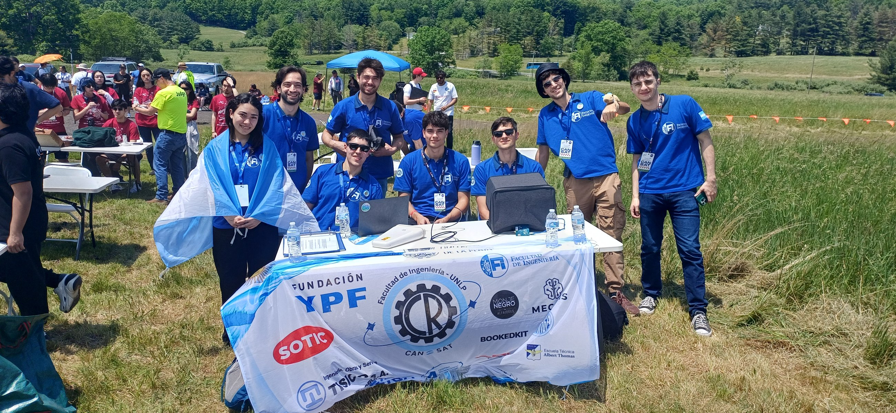

El parafoil era la parte más visible de nuestro CanSat. También era solo una parte del problema.

La misión exigía que una carga del tamaño de una lata se separara de un cohete, desplegara un sistema de recuperación direccionable, navegara hacia un objetivo y liberara un huevo crudo cerca del suelo. Cualquiera de esas funciones podía fallar por una decisión tomada en otra parte del sistema.

Mi trabajo se concentró en el diseño aerodinámico, el modelado, la fabricación y los ensayos físicos del parafoil. Eso me dejó directamente sobre varias interfaces: el ala dependía de la masa suspendida, el centro de gravedad, los puntos de unión estructural, los servos, la electrónica, la secuencia de despliegue y la lógica de guiado. Un cambio en cualquiera de ellos podía invalidar un cálculo o retrasar una prueba.

En otro artículo conté [el desarrollo técnico del parafoil](/es/posts/trayendo-un-huevo-desde-el-espacio-con-un-parapente/). Este trata sobre la lección más amplia que me dejó el proyecto: la ingeniería de sistemas no es una etapa final de integración. Es el trabajo de mantener conectadas las decisiones desde el principio.

## 1. Las interfaces importan más que los límites entre equipos

Al comienzo dividimos el proyecto entre mecánica y aerodinámica, electrónica y software. La organización parecía lógica porque cada persona podía concentrarse en una disciplina conocida. El problema era que el CanSat no respetaba esas fronteras.

El ángulo de calaje del parafoil dependía de la posición del centro de gravedad de la carga. Ese centro de gravedad dependía en gran medida de dónde estuvieran montadas la batería y la electrónica. Las cargas de mando influían en la selección de los servos, mientras que su geometría definía el recorrido disponible en las líneas de freno. Incluso un cambio en el chasis estructural podía modificar la resistencia aerodinámica y la condición de planeo en equilibrio.

Las conversaciones puntuales resolvían preguntas aisladas, pero no mostraban la cadena completa de dependencias. Necesitábamos una vista explícita de las interfaces: qué esperaba cada subsistema de los demás, qué valores todavía eran supuestos y quién debía enterarse cuando alguno cambiaba.

Esto se volvió evidente después de fabricar la segunda campana. Descubrimos que las líneas de suspensión se habían calculado usando una posición incorrecta del centro de gravedad. El ala estaba terminada, pero un supuesto de interfaz entre aerodinámica y estructuras no. Recuperamos el diseño ajustando el suspentaje y desplazando la electrónica hacia arriba, aunque la corrección consumió tiempo y redujo el margen para nuevos ensayos.

La lección no fue simplemente "hay que comunicarse más". Fue tratar los valores de interfaz como datos controlados de diseño, no como información informal que circula entre equipos.

## 2. Las revisiones y los registros de decisiones preservan supuestos

La competencia exigía una Revisión Preliminar de Diseño (PDR, por sus siglas en inglés) y una Revisión Crítica de Diseño (CDR). Al principio, esos hitos podían sentirse como presentaciones agregadas por encima del trabajo real. En la práctica, resultaban útiles cuando nos obligaban a responder preguntas diferentes.

La PDR preguntaba si la arquitectura propuesta podía cumplir la misión. La CDR preguntaba si el diseño real estaba suficientemente definido para fabricarlo e integrarlo. No son el mismo nivel de certeza.

Las revisiones servían menos cuando documentábamos solo el valor elegido. Anotar que una línea tenía cierta longitud o que la campana usaba determinada superficie no preservaba las condiciones detrás de la decisión. También necesitábamos el motivo, la fuente, los supuestos y la consecuencia de modificarla.

Esa diferencia importa porque un CanSat evoluciona rápido. Un requisito puede cambiar, un componente puede dejar de estar disponible o una estimación de masa puede convertirse en una medición. Sin un registro de decisiones, el equipo debe reconstruir razonamientos viejos bajo presión de tiempo. Peor todavía, alguien puede actualizar un número sin advertir que otro subsistema sigue dependiendo del anterior.

El ejemplo que mejor recuerdo es la bahía de electrónica, justamente porque no recuerdo el motivo detrás de ella. Empezó en la parte inferior del CanSat por una razón que nadie dejó por escrito. Cuando la revisamos más adelante, nada obligaba a mantenerla ahí, y moverla arriba subió el centro de gravedad como necesitaba la campana. Una sola línea que registrara por qué estaba abajo nos habría dicho mucho antes si esa posición era una restricción real o simplemente un resto de una decisión vieja.

Documentar bien no significaba registrar cada conversación. Significaba preservar el pequeño conjunto de decisiones que condicionaban al sistema.

## 3. Los primeros ensayos deben aislar la incertidumbre

Nuestro primer ensayo de caída del parafoil intentó reproducir demasiadas partes de la misión al mismo tiempo. Usamos una réplica del CanSat con su masa y geometría completas y liberamos todo el conjunto desde unos 20 metros.

Cayó casi como una piedra.

El resultado fue dramático, pero poco informativo. Había varias explicaciones posibles: las entradas podían ser demasiado pequeñas, la geometría del suspentaje podía estar cerrando las puntas, la carga alar podía ser demasiado alta, la secuencia de plegado podía demorar el inflado o la prueba podía no tener altura suficiente.

Al acoplar todas esas incertidumbres en una sola caída, habíamos creado un ensayo realista antes de crear uno diagnóstico.

Las pruebas siguientes se volvieron más útiles cuando cada una se organizó alrededor de una pregunta. ¿Podía inflarse el ala durante una extracción manual? ¿Las celdas exteriores permanecían abiertas bajo tensión? ¿La bolsa de despliegue extendía las líneas antes de liberar la tela? Solo cuando esos mecanismos se comportaron de manera consistente tuvo sentido hacer una liberación completa con dron.

Dejé de pensar los ensayos tempranos como versiones reducidas de la misión final. Su función era volver observable una incertidumbre por vez.

## 4. La integración es un problema de cronograma además de técnico

Un ensayo integrado requiere algo más que subsistemas que funcionen por separado. Necesita que estén disponibles al mismo tiempo.

No podíamos probar el control autónomo solo con software. Necesitábamos una campana terminada, una estructura capaz de soportarla, la electrónica instalada, sensores operativos, actuadores con el recorrido correcto, un mecanismo seguro de liberación y tiempo para inspeccionar el resultado antes del siguiente intento.

Si un solo elemento llegaba tarde, toda la ventana de ensayo se desplazaba. Nos pasó con el mecanismo de liberación: su electrónica no estuvo lista a tiempo, y nos costó un ensayo con dron. Mientras tanto, los equipos que ya tenían su hardware podían seguir mejorando su propio subsistema, pero ese avance local no necesariamente reducía el riesgo de la misión.

Eso cambió mi forma de entender un cronograma. Una lista de fechas individuales no alcanza. Las fechas importantes son aquellas en las que varios subsistemas deben converger para responder una pregunta a nivel de sistema. Esos hitos de integración necesitan margen para encontrar un problema, modificar el diseño y volver a probar.

Nuestras pocas oportunidades de ensayo en campo hicieron que ese margen se volviera especialmente visible. Una prueba exitosa dependía de mucho más que tener el hardware teóricamente listo en un documento.

## 5. La logística forma parte del sistema de ingeniería

La tela, las líneas de Kevlar, los tornillos, las baterías, el acceso al taller, los sponsors, los permisos, el transporte, el clima y la disponibilidad de un piloto de dron nunca aparecieron en las ecuaciones aerodinámicas. Aun así, determinaron qué podíamos fabricar y probar.

Para la campaña final necesitábamos un lugar adecuado, coordinación con el aeródromo, permiso para operar, un dron con su piloto, clima aceptable, equipos cargados, un plan de recuperación y un equipo disponible al mismo tiempo. Una demora en cualquiera de esos elementos podía borrar la ventana de ensayo.

Yo pensaba la logística como un soporte alrededor de la ingeniería. El CanSat dejó claro que impone restricciones técnicas reales. Los plazos de compra influyen en las decisiones de diseño. La disponibilidad del taller influye en la secuencia de fabricación. El acceso al campo influye en cuántas iteraciones pueden completarse. La coordinación operativa influye en qué puede probarse de forma segura.

Nuestro punto débil fue más simple. Recién empezamos a armar la lista de compras cuando ya habíamos llegado a la final. Decidir no comprar componentes antes de clasificar puede ser una decisión razonable. No tener la lista preparada no lo es: cada elemento identificado tarde empezó tarde su tiempo de entrega.

Nada de eso reemplaza al análisis. Define si el análisis puede convertirse en evidencia.

## Lo que me quedó del proyecto

El proyecto me enseñó más que dimensionar y fabricar una campana ram-air. Me enseñó a buscar los supuestos que cruzan los límites entre subsistemas, preservar el razonamiento detrás de las decisiones, diseñar ensayos alrededor de la incertidumbre, organizar el cronograma alrededor de la integración y tratar las operaciones como parte del sistema.

No demostramos todos los objetivos de la misión autónoma original. Sí construimos y probamos un parafoil desplegable que se inflaba simétricamente y establecía un planeo estable, y entendimos con precisión qué partes de nuestro proceso lo hicieron posible o lo volvieron más difícil.

Eso es lo que llevaría a otro proyecto aeroespacial: no la promesa de que el primer diseño va a funcionar, sino una mejor forma de descubrir por qué no funciona, coordinar la corrección y convertir el siguiente ensayo en evidencia útil.
