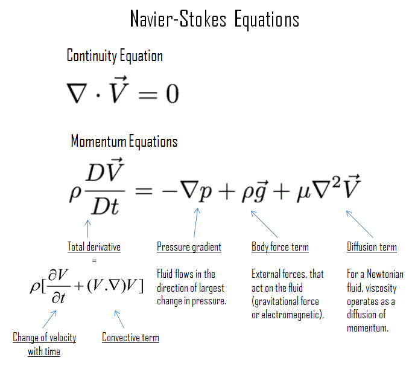
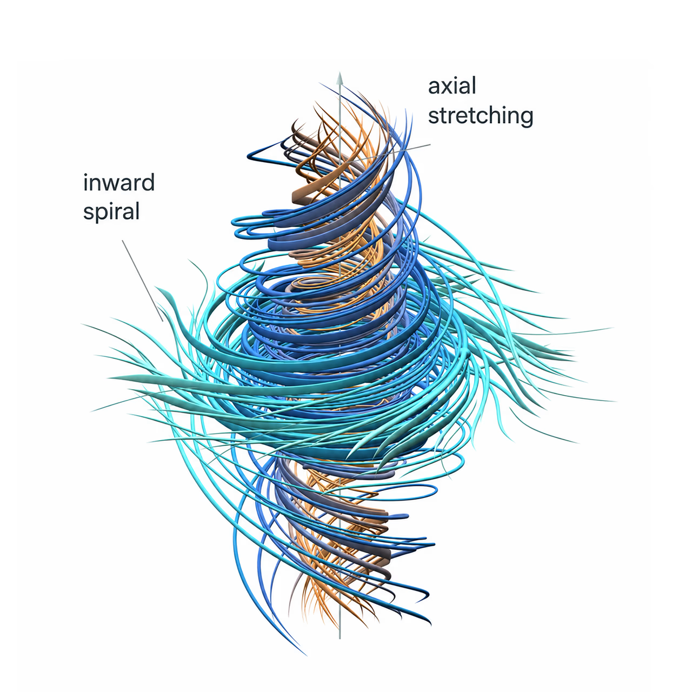



*Basado en la información disponible al 9 de septiembre de 2026.*

Cuando dije que también iba a compartir noticias por acá, nunca pensé que la primera iba a llegar tan rápido. Mucho menos que iba a estar escribiendo sobre una IA que produjo una propuesta de resolución de un Problema del Milenio.

Tuve que frenar un momento para asimilarlo.

Estamos hablando de problemas elegidos para representar algunas de las preguntas abiertas más profundas de las matemáticas. Y ahora OpenAI publicó una demostración generada por IA que afirma resolver uno de ellos: el problema de existencia y suavidad de Navier-Stokes. Si supera la revisión, sería un logro matemático histórico con la IA en el centro de su descubrimiento. [Anuncio de OpenAI](https://openai.com/index/navier-stokes-solution/), [Problemas del Milenio](https://www.claymath.org/millennium-problems/).

El anuncio también vino acompañado de una disputa sobre reconocimiento, investigaciones paralelas y el posible uso de trabajo inédito. Son cuestiones que merecen atención, pero voy a dejarlas fuera de este artículo. Lo que me interesa entender acá es el avance matemático que se afirma haber conseguido, cómo participó la IA y por qué importa el resultado. [Declaración de Buckmaster](https://cims.nyu.edu/~tristanb/statement.pdf), [respuesta de OpenAI](https://openai.com/index/navier-stokes-solution/).

Según OpenAI, unos 10.000 agentes coordinados trabajaron durante 88 horas para llegar al resultado, seguidas por otras 17 horas de formalización y verificación en Lean. El trabajo combinó un modelo interno, herramientas computacionales y coordinación humana. Fue una operación de investigación considerable, cuyo resultado reportado va mucho más allá de responder una pregunta de examen o reproducir una demostración conocida. [Relato de OpenAI](https://openai.com/index/navier-stokes-solution/).

Eso es lo extraordinario: una IA participando en la creación de conocimiento matemático a este nivel.

La palabra "propuesta" sigue siendo importante. Publicar una demostración, verificarla formalmente y alcanzar la aceptación de la comunidad matemática son cosas distintas. Pero podemos ser precisos con esa diferencia sin perder de vista la dimensión del anuncio.

Entonces, ¿qué consiguió demostrar el sistema? ¿Y cómo puede un resultado que dice que las ecuaciones dejan de funcionar contar como la resolución de un problema de un millón de dólares?

## Las ecuaciones detrás del movimiento de los fluidos

Pensemos en el aire alrededor de un ala. Su velocidad cambia de un lugar a otro. La presión lo empuja, las capas vecinas intercambian cantidad de movimiento mediante la viscosidad y el propio flujo transporta esos cambios.

Las ecuaciones de Navier-Stokes describen ese balance de cantidad de movimiento. Son parte de la base matemática de la dinámica de fluidos computacional, o CFD, que utilizamos para estudiar el movimiento de los fluidos. [Introducción de NASA](https://www1.grc.nasa.gov/beginners-guide-to-aeronautics/navier-strokes-equation/).

Para un fluido incompresible de densidad constante, podemos escribir:

$$
\frac{\partial \mathbf{u}}{\partial t}
+(\mathbf{u}\cdot\nabla)\mathbf{u}
=-\frac{1}{\rho}\nabla p+\nu\nabla^2\mathbf{u}+\mathbf{f},
\qquad \nabla\cdot\mathbf{u}=0.
$$

Aquí, **u** es la velocidad, **p** la presión, **ρ** la densidad, **ν** la viscosidad cinemática y **f** la fuerza externa por unidad de masa.

A la izquierda aparece la aceleración. A la derecha están la presión, la viscosidad y las fuerzas externas. La segunda ecuación impone incompresibilidad. [Formulación matemática](https://www.claymath.org/wp-content/uploads/2022/06/navierstokes.pdf).

Conocer las ecuaciones no responde automáticamente todas las preguntas sobre sus soluciones. En particular, calcular un flujo determinado y demostrar una garantía para toda una clase de flujos son tareas muy diferentes.

## Por qué se convirtió en un Problema del Milenio

En el año 2000, el Clay Mathematics Institute seleccionó siete Problemas del Milenio, asignando un millón de dólares a cada uno. Navier-Stokes comparte esa lista con P versus NP, la hipótesis de Riemann, la conjetura de Hodge, la conjetura de Birch y Swinnerton-Dyer, Yang-Mills y la brecha de masa, y la conjetura de Poincaré. Clay actualmente reconoce Poincaré como resuelto, a partir del trabajo de Perelman. [Problemas del Milenio](https://www.claymath.org/millennium-problems/).

En Navier-Stokes, la pregunta central trata sobre existencia y suavidad en tres dimensiones. ¿Puede un movimiento inicialmente suave desarrollar una singularidad en tiempo finito? "Suave" es una condición matemática de regularidad; no significa simplemente que el flujo parezca tranquilo.

El enunciado oficial ofrece varias alternativas. Las alternativas de ruptura, C y D, permiten fuerzas externas suaves. Un contraejemplo que satisfaga alguna de ellas puede resolver el problema del premio sin resolver el caso sin fuerzas externas. [Enunciado oficial](https://www.claymath.org/wp-content/uploads/2022/06/navierstokes.pdf).

Ese detalle es esencial para entender el resultado propuesto.

## Qué significa la respuesta negativa

El paper de OpenAI construye un flujo tridimensional incompresible que parte del reposo y recibe una fuerza externa suave. Su velocidad crece sin cota al aproximarse a un tiempo finito, mientras la energía cinética total permanece acotada.

La construcción concentra el movimiento en una región de vórtice cada vez menor y utiliza correcciones oscilatorias para mantener suave la fuerza. La fuerza no se vuelve infinita. Esa es la ruptura que se afirma haber demostrado. [Paper, teorema 1.1 y sección 2](https://cdn.openai.com/pdf/32d9f210-8b73-45e0-91bc-82a30aef8a9a/navier-stokes.pdf).

Una forma útil de entender la lógica es distinguir una garantía de un ejemplo.

Una garantía afirma que todos los integrantes de una clase se comportan de cierta manera. Para descartarla, alcanza con un contraejemplo válido. No hace falta demostrar que la falla es frecuente, probable o fácil de reproducir en un laboratorio.

Por eso, si la prueba se sostiene, las entradas suaves por sí solas no garantizan una evolución suave para toda esta clase de flujos forzados.

Decir que "las ecuaciones se rompen solas" transmite parte de la sorpresa. Pero necesita la aclaración de que una fuerza externa participa en la construcción. Sería engañoso describirlo como un fluido al que simplemente dejamos evolucionar solo.

*Visualización de OpenAI del flujo propuesto, con espiral hacia adentro y estiramiento axial. Ver el [anuncio original](https://openai.com/index/navier-stokes-solution/) y el [paper, Figura 1](https://cdn.openai.com/pdf/32d9f210-8b73-45e0-91bc-82a30aef8a9a/navier-stokes.pdf).*

## Por qué descubrir una falla es útil

Una respuesta positiva ofrecería una garantía amplia. Una respuesta negativa establece que las hipótesis detrás de esa garantía no alcanzan.

Eso es un resultado significativo. Cambia lo que debemos intentar garantizar y las restricciones que necesitamos examinar.

Las preguntas siguientes apuntan a las condiciones que impiden la ruptura. ¿Qué podemos restringir sobre la fuerza? ¿Qué propiedades del flujo inicial importan? ¿Qué magnitudes, si se mantienen controladas durante la evolución, aseguran que la solución siga siendo regular?

Estas preguntas no se vuelven fáciles de repente. Pero un mecanismo concreto de falla les da a los investigadores algo específico para estudiar. Puede revelar por qué falla un argumento, qué no captura una estimación o qué hipótesis adicionales merecen atención.

Así interpretaría su importancia: un contraejemplo válido identificaría un límite preciso de una supuesta garantía universal.

## Qué sigue abierto

Acá hay dos cuestiones diferentes.

Primero, la formulación del premio. Una prueba correcta que satisfaga alguna de las alternativas de ruptura aceptadas resolvería ese desafío. Utilizar una fuerza no la convierte en media solución.

Segundo, la matemática más amplia de los fluidos. La pregunta correspondiente sin fuerzas externas no queda respondida por esta construcción. Lógicamente, podría existir ruptura con fuerzas y evolución suave para cualquier flujo inicial admisible sin ellas.

Ambos casos importan. Las fuerzas externas son una parte relevante de la mecánica de fluidos, y entender qué puede hacer un fluido viscoso a partir de su movimiento inicial sigue siendo una pregunta fundamental.

También está la diferencia entre un modelo matemático y un fluido físico. Una velocidad matemática no acotada no predice que una sustancia real se mueva literalmente a velocidad infinita. Interpretar físicamente la construcción exige revisar las hipótesis del modelo y su rango de aplicación.

## Dónde entran la IA y Lean

El anuncio combina dos actividades: producir un argumento matemático y comprobar una versión formal.

Lean es un asistente de demostraciones. Su núcleo verifica si un enunciado formal se deduce de las definiciones, hipótesis y pruebas proporcionadas. Sigue siendo importante establecer que esos enunciados e hipótesis representan fielmente la matemática que se pretende demostrar. [Guía de Lean para validar pruebas](https://lean-lang.org/doc/reference/latest/ValidatingProofs/).

OpenAI publicó un repositorio con las formalizaciones y las instrucciones para verificarlas de forma independiente. Yo no ejecuté esas comprobaciones. [Repositorio de las pruebas](https://github.com/openai/NavierStokesAndEuler).

Al 9 de septiembre, Clay todavía clasifica Navier-Stokes como no resuelto. Las reglas del premio exigen publicación en un medio que cumpla sus requisitos, un mínimo de dos años posteriores y aceptación general de la comunidad matemática. Esas condiciones no deben confundirse con un veredicto automático sobre una prueba recién publicada. [Estado actual](https://www.claymath.org/millennium/navier-stokes-equation/), [reglas del premio](https://www.claymath.org/millennium-problems/rules/).

En esta etapa, corresponde hablar de una propuesta de resolución con una formalización publicada, cuya evaluación más amplia todavía está desarrollándose.

## Qué cambia para la ingeniería

No descartaría una simulación validada por este anuncio. Tampoco confiaría en una simulación sin validar porque se hubiera demostrado un gran teorema.

La confianza en ingeniería surge de examinar el cálculo que realmente hicimos: sus hipótesis, comportamiento numérico, resolución, incertidumbres y comparación con evidencia adecuada. Un teorema universal de suavidad no eliminaría ese trabajo, y un contraejemplo tampoco lo reemplaza.

Por eso, el impacto inmediato sobre un flujo de trabajo cotidiano de CFD puede ser pequeño. La importancia matemática a largo plazo podría ser considerable.

Lo que me atrae de esta historia es la combinación: ecuaciones que usamos en ingeniería, una garantía que va mucho más allá de cualquier simulación individual y sistemas de IA ayudando a producir argumentos que otras personas pueden inspeccionar.

Si la demostración supera ese examen, respondería una pregunta matemática importante. Comprender esa respuesta, sus límites y qué investigar después todavía nos dejaría bastante trabajo.
