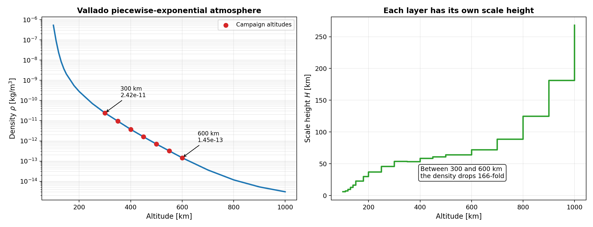
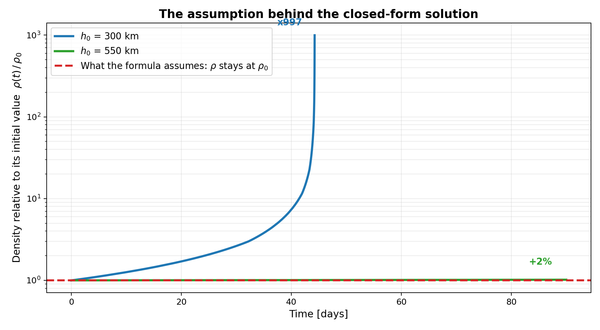
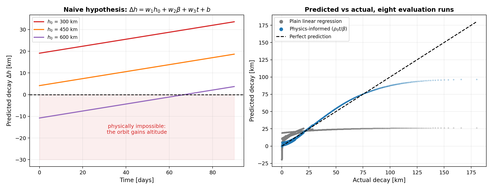
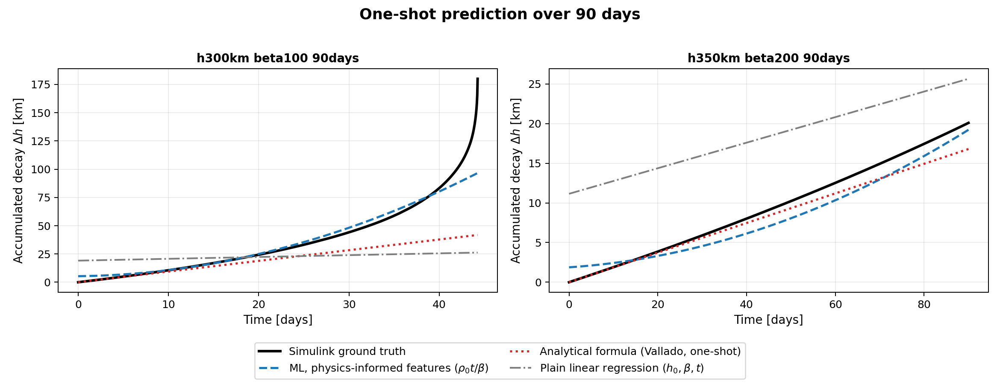
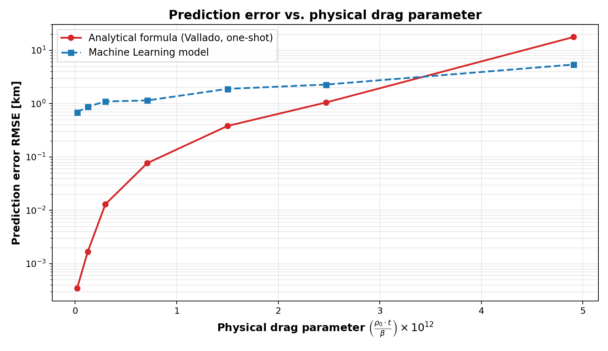
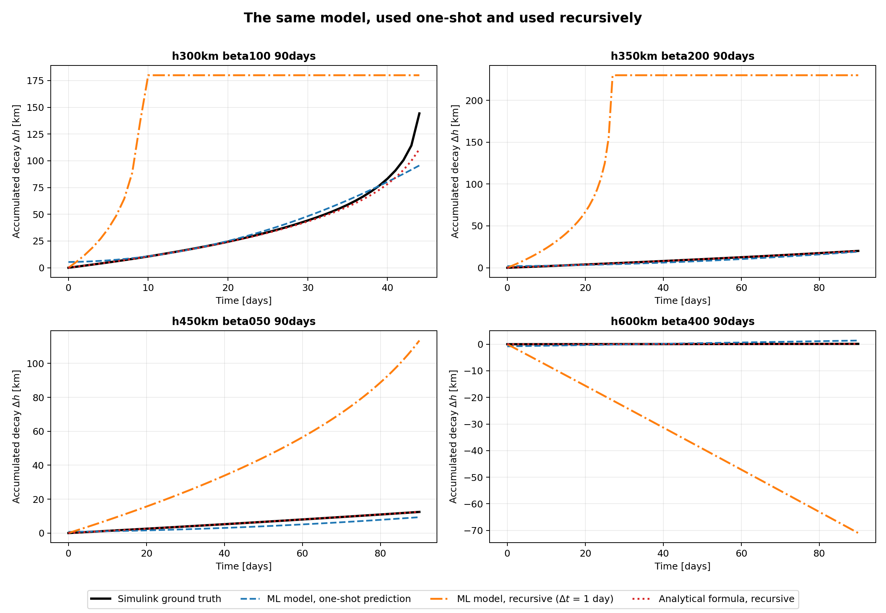



A satellite in low Earth orbit is falling. Slowly, but it is falling.

There is a classical formula that predicts how fast, and it has been in the textbooks for decades. After finishing Andrew Ng's *Supervised Machine Learning: Regression and Classification*, I wanted to know something specific: could the simplest model in that course, a multiple linear regression trained with gradient descent, do better than the formula?

The short answer is yes, in one particular regime, and by a wide margin.

The interesting answer is that getting there had almost nothing to do with the algorithm. I never changed it. What changed, three times, was what I decided to tell the model about the world.

## Why a satellite falls at all

Space is usually pictured as a vacuum, and at 300 kilometres it very nearly is. The air up there is about one hundred-billionth of what you are breathing right now.

But the satellite is moving through it at 7.7 kilometres per second, and it never stops. Over weeks and months, that whisper of atmosphere adds up.

The drag force is the same one from any fluid mechanics course:

$$F_D = \tfrac{1}{2}\rho v^{2} C_D A$$

What matters for the trajectory is not the force but the force per unit mass, and when you divide through, all the properties of the spacecraft collapse into a single number. It is called the **ballistic coefficient**:

$$\beta = \frac{m}{C_D A}$$

Think of it as how well an object ignores the air. A dense, compact satellite has a high β and shrugs the atmosphere off. A light CubeSat with its solar panels deployed has a low β and a much shorter life. In the simulations that follow, β ranges from 50 to 400 kg/m².

Here is the part that surprises almost everyone the first time.

Drag removes energy from the orbit. The specific orbital energy is

$$\varepsilon = -\frac{\mu}{2a}$$

so losing energy makes ε more negative, which makes the semi-major axis *a* shrink. The orbit gets smaller. But orbital speed goes as the inverse square root of *a*, which means that as the satellite loses energy, **it goes faster**.

Drag is a brake that speeds you up. The trick is that the satellite is trading altitude for speed: potential energy drops about twice as fast as kinetic energy rises, and the difference is what the atmosphere carries away as heat.

If you set the power dissipated by drag equal to the rate of change of orbital energy, you get the equation this entire project revolves around:

$$\frac{da}{dt} = -\sqrt{\mu a}\left(\frac{v_{rel}}{v}\right)^2 \cdot \frac{\rho}{\beta}$$

Three ingredients. Where you are, what you are, and what you are flying through.

That last one is where the difficulty lives.

## The atmosphere is the hard part

Atmospheric density falls off roughly exponentially with altitude, but no single exponential works across the whole range. The rate of falloff, called the scale height, is about 7 km near the ground and 268 km at 1000 km altitude.

The model I used, from Vallado's *Fundamentals of Astrodynamics and Applications*, handles this by stacking **28 layers**, each with its own reference density and its own scale height:

$$\rho(h) = \rho_{0,i}\exp\left(-\frac{h - h_{0,i}}{H_i}\right)$$

Look at that left panel and notice the vertical axis is logarithmic. Between 300 and 600 kilometres, a difference you could drive in three hours, the density drops by a factor of 166.

Now put the two pieces together and you get the feedback loop that defines the whole phenomenon:

The satellite loses a little altitude. Lower altitude means exponentially denser air. Denser air means more drag. More drag means it loses altitude faster. Which means denser air still.

Orbital decay is not linear, and it is not even exponential. It is slow, slow, slow, and then a wall. That shape is going to matter enormously in a moment.

## The formula I was trying to beat

The differential equation above has a closed-form solution, provided you are willing to freeze one thing.

Substitute the square root of *a* and the equation becomes beautifully simple:

$$\frac{d\sqrt{a}}{dt} = -\frac{\rho}{2\beta}\sqrt{\mu}$$

If ρ is a constant, the right-hand side is a constant, and a constant integrates in one line:

$$\sqrt{a(t)} = \sqrt{a_0} - \frac{\rho_0}{2\beta}\sqrt{\mu}\left(\frac{v_{rel}}{v}\right)^{2}t$$

The last factor accounts for the satellite's velocity relative to the atmosphere, which rotates along with the Earth.

This is a good formula. It is the baseline any machine learning model has to justify itself against. In practice no one would use it in a single 90-day step at low altitude (it would be integrated step by step), but my goal was not to replace a numerical integrator; it was to see whether a static, single-step model could capture the accumulated decay at once. In this experiment, its density comes from the same Vallado model used in the simulator, but it is frozen at the initial altitude for the whole prediction.

But look hard at the assumption. It holds ρ fixed at its initial value for the entire propagation, and ρ is precisely the quantity we just established runs away.

For the 550 km, β = 100 kg/m² trajectory, the assumption costs almost nothing: over ninety days the real density rises by less than 2%, so the red line is right the whole way. For the 300 km trajectory with the same ballistic coefficient, the density ends up **997 times** its initial value, and the formula never notices.

This single figure predicts everything that follows. High and slow: the classical solution is nearly exact and there is nothing to improve. Low and fast: there is a gap, and the gap is enormous.

## The experiment

I already had a [6-degree-of-freedom orbital simulator](/posts/6dof-leo-satellite-simulator/) I had built in Simulink, so I used it to generate the data.

The campaign was a grid: initial altitudes from 300 to 600 km, ballistic coefficients from 50 to 400 kg/m², circular equatorial orbits, ninety-day horizons. Twenty-eight complete trajectories, sampled every ten minutes.

The quantity to predict is the accumulated decay:

$$\Delta h = h_0 - h(t)$$

One decision here matters more than it looks. **The split is by whole trajectories, never by individual points.** Sixteen runs for training, four for validation, eight held out for the final evaluation. Splitting by row instead would put consecutive samples of the same trajectory on both sides, and the model would score well for interpolating between points it had already seen.

Everything that follows is multiple linear regression with feature scaling, trained by batch gradient descent at a learning rate of 0.03. No trees, no networks, no library models. The only thing that ever changes is the contents of X.

## First attempt: telling it the numbers

I started where the course starts. Give the model everything I know and let it sort it out:

$$\Delta h = w_1 h_0 + w_2\beta + w_3 t + b$$

Validation RMSE: **27.86 km**. The cost function converged beautifully, and the model is nonsense.

Look at the left panel. At 600 km, the model predicts the satellite *gains* eleven kilometres of altitude. Not a small error. A physically impossible answer.

There are two failures stacked on top of each other, and both are instructive.

The first is that the model is **linear in time**, and decay accelerates. A straight line drawn through a curve that ends vertically has to be too steep at the beginning and hopelessly too shallow at the end. You can see it in the right panel: the grey cloud flattens out around 25 km while the real decay keeps climbing past 180.

The second failure is deeper. The model is **linear in altitude**. But altitude does not act on drag directly. It acts through density, and that relationship is exponential across eight orders of magnitude. Asking a single linear term in h₀ to represent that is asking a straight line to approximate a curve like the one in the atmosphere figure.

I tried adding a t² term. Validation RMSE went to 27.88 km, very slightly worse, and it introduced a new problem. The fitted weight on t² came out negative, so at long horizons the parabola curves back downward and the satellite starts climbing again.

## Second attempt: telling it the numbers interact

The obvious next thought is that these variables are not independent. Altitude changes *how strongly* time acts. So give the model products instead of separate terms:

| Hypothesis | Features | Validation RMSE |
|---|---|---:|
| Coupled with β | t, t², h₀t, βt | 26.40 km |
| Coupled with 1/β | t, t², h₀t, t/β | 26.29 km |
| Polynomial in altitude | h₀, β, t, t², h₀² | 25.62 km |

Three attempts. A six percent improvement. Essentially nothing.

There is one small piece of good news buried in that table: the version using t/β beats the one using βt. The physics says decay should scale with the inverse of the ballistic coefficient, and the data agrees. Physical reasoning was pointing in the right direction, even if it was not yet enough.

But all three hypotheses repeat the same mistake. **They keep feeding the model altitude.** Adding h₀² to chase an exponential is a losing game. You would need a very high-order polynomial, and it would still explode the moment you stepped outside the fitted range.

## Third attempt: telling it the physics

The fix was not a better algorithm. It was refusing to make the model rediscover something I already knew.

I do not need a regression to learn the structure of the atmosphere. Vallado's model is already inside my simulator and provides the atmospheric reference used consistently throughout this experiment. So I stopped giving the model altitude and started giving it the thing altitude actually controls:

$$\rho_0 = \rho(h_0)$$

computed with Vallado's 28 layers, before the data ever reaches the regression.

Then I went back to the differential equation and read off the combination that genuinely drives the physics. The rate of decay depends on ρ divided by β, so over a horizon *t* the natural variable is not time, altitude and mass separately. It is:

$$x_1 = \frac{\rho_0 t}{\beta}$$

I added its square, to give the model the curvature that the constant-density solution structurally cannot produce, and kept additional terms for residual adjustments:

$$\Delta h = w_1\frac{\rho_0 t}{\beta} + w_2\left(\frac{\rho_0 t}{\beta}\right)^{2} + w_3\frac{t}{\beta} + w_4\rho_0 + w_5 t + w_6\beta + b$$

Six features. Keeping time-independent terms ($\rho_0, \beta, b$) helped minimize RMSE in this static evaluation, though it introduces a conceptual limitation that becomes critical when using the model iteratively.

Validation RMSE: **7.03 km**, against 25.62 for the best of everything that came before.

That is not an incremental gain. That is a different regime.

## What came out

On the eight held-out runs, evaluated at every ten-minute sample:

| Model | RMSE | MAE | Median error |
|---|---:|---:|---:|
| **Physics-informed regression** | **2.371 km** | **1.128 km** | 0.670 km |
| Classical formula (one-shot) | 6.783 km | 1.505 km | **0.017 km** |
| Plain linear regression | 11.268 km | 7.727 km | 6.844 km |

Mean absolute error went from **7.73 km to 1.13 km**, beating the classical formula on that aggregate metric. The median error fell from 6.84 km to 670 metres, although the classical formula still has the lower median error at 17 metres.

That difference is important. The classical formula has the best typical error and the second-worst RMSE at the same time.

That is not a contradiction. It is a fingerprint. It is what you see when a model is nearly perfect almost everywhere and catastrophic in one specific place.

## Where each tool wins

So I went looking for that place.

Grouping the errors by altitude gave a muddled picture. Grouping by t/β was not much better. What finally made it snap into focus was grouping by the coupled quantity from the feature itself: ρ₀t/β, the physical drag parameter.

Below the crossover, around 3.4×10⁻¹², the classical formula is two to three orders of magnitude more accurate. This occurs in higher orbits (above ~500 km) or over short time horizons, where density barely changes and assuming constant $\rho_0$ introduces negligible error. Machine learning has nothing to add in this regime.

Above that threshold, the satellite experiences significant drag (such as orbits below 450 km or low ballistic coefficients over several months). As it descends into denser atmospheric layers, the constant-density assumption breaks down: the classical formula's error climbs to 17.8 km, while the learned model maintains an error near 5.4 km, proving up to 4.5 times more accurate in the most severe cases.

Honestly, the most useful output of this project is not the model. It is that threshold. It tells you which tool to reach for before you have done any work.

## Bonus track: it broke when I used it twice

One last experiment, and it is the one that taught me the most.

Everything above asks the model a single question: what is the decay after *t* days? But a real mission-planning tool works differently. It steps forward, recomputing the altitude and therefore the density at every step.

Same model, used a second way. With one-day steps:

| | Learned model | Classical formula |
|---|---:|---:|
| One-shot over 90 days, MAE | **1.15 km** | 1.54 km |
| Recursive, 1-day steps, MAE | **61.53 km** | **0.144 km** |

The formula *improves*. Stepped forward it becomes a first-order Euler integrator, its assumption only has to survive a single day at a time, and its mean error drops to 144 metres. My model fell apart.

The comfortable explanation is that machine learning models compound error under recursion. That is also a way of not looking.

The real reason is sitting in the feature list. Three of those six terms (ρ₀, β and the intercept b) **do not depend on time at all**. So evaluate the model at t = 0 and you get a number that is not zero. At 300 km, it predicted 5.34 km of decay before any time had passed.

Δh(0) = 0 is not an approximation. It is an identity. One-shot, that offset hides inside the averages. Recursively, it gets re-injected at every step and then feeds back on itself, because the phantom decay lowers the working altitude, which raises the density, which enlarges the next step's error.

Fixing it turned out to be pure feature engineering again, but that is a story for another post.

## What I took away

**Feature engineering is where domain knowledge enters a model.** The whole jump, from 7.73 km to 1.13 km, came from replacing altitude with density and forming ρ₀t/β. The algorithm never changed.

**Do not make a model rediscover what you already know.** Vallado's atmosphere is already a consistent reference model for this experiment. Spending model capacity approximating it would have been waste.

**A converged cost function tells you nothing about whether the hypothesis is right.** Mine converged beautifully while predicting that satellites gain altitude.

**Validate a model the way you intend to use it.** One-shot accuracy and step-by-step stability are different properties, and the gap between them was a factor of fifty.

**And know when not to use machine learning.** Below 3.4×10⁻¹² the century-old closed form wins and it is not close. The model earned its place in one specific regime, which is a smaller claim than I set out to make and a much more useful one.

The simulator, the data campaign, the models and every figure in this post are public:

**[View the orbital decay project on GitHub](https://github.com/Allaneo/orbital-decay-linear-regression)**
