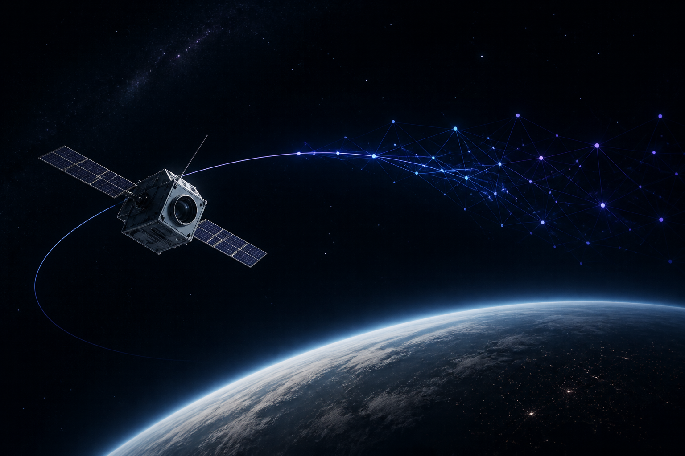

Soy Allan, ingeniero aeroespacial.

En los últimos años participé en proyectos y experiencias que disfruté mucho y me dejaron bastante para contar, desde la AAS CanSat Competition hasta el desarrollo de un simulador 6DoF para satélites LEO.

Al mismo tiempo, estoy profundizando mi formación en machine learning e inteligencia artificial. Es un campo que me entusiasma y mi objetivo no es quedarme solamente con la teoría, sino aplicar lo que aprendo en proyectos de ingeniería.

Creé este espacio para reunir esas dos cosas: desarrollar nuevas ideas y compartir tanto los resultados como las experiencias y enseñanzas que aparecen en el camino.

También me sirve como una forma de obligarme a entender mejor cada proyecto, ordenar lo que aprendí y dejarlo disponible para alguien a quien pueda resultarle útil.

Si algo de lo que comparto te genera una duda, un comentario o simplemente querés darme feedback, podés contactarme por LinkedIn o por correo. Siempre estoy abierto a intercambiar ideas y escuchar otras perspectivas.

Además de proyectos, seguramente comparta noticias, investigaciones o avances tecnológicos que me llamen la atención. No quiero simplemente resumirlos, sino pensar por qué pueden ser importantes y qué implicaciones podrían tener para la ingeniería y el sector aeroespacial.

También habrá lugar para experimentos más pequeños, herramientas que esté probando y preguntas para las que todavía no tenga una respuesta definitiva.

No quiero limitar este espacio a un único tema. Habrá simulación, mecánica orbital, aerodinámica, estructuras, control, ML, IA y seguramente otras cosas que todavía no tengo planeadas.

Este espacio va a ser una forma de registrar y compartir ese recorrido mientras sucede. No sé exactamente qué proyectos van a aparecer más adelante, pero justamente esa es parte de la idea.

Si compartís esta curiosidad por la ingeniería y la tecnología, este espacio también es para vos.
